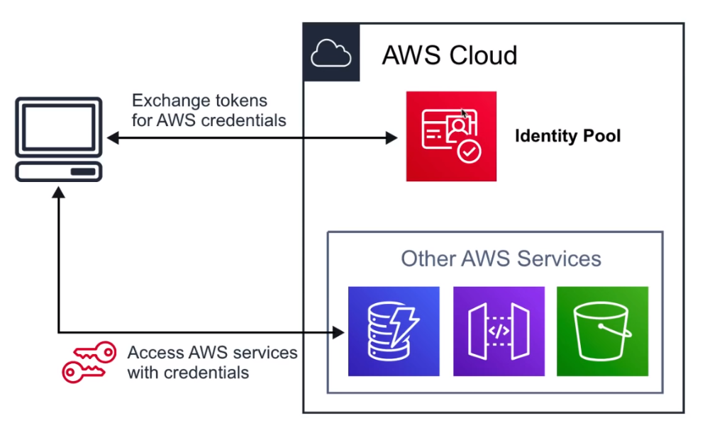
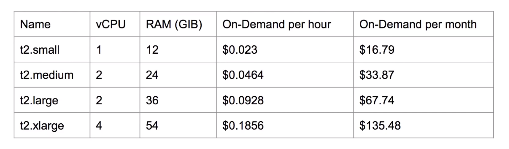

# AWS Certified Solutions Architect

## Table of Contents

- [FAQ](#faq)
- [Exam Guide Overview](#exam-guide-overview)
- [Architecture 101](#architecture-101)
  - [Access Management](#access-management)
  - [Shared Responsibility Model](#shared-responsibility-model)
  - [Service Models](#service-models)
  - [High Availability vs Fault Tolerance](#high-availability-vs-fault-tolerance)
  - [RPO vs RTO](#rpo-vs-rto)
  - [Tiered Application Design](#tiered-application-design)
  - [Encryption](#encryption)
  - [Odds and Ends](#odds-and-ends)
  - [AWS Accounts](#aws-accounts)
  - [AWS Physical and Networking Layer](#aws-physical-and-networking-layer)
  - [AWS Well-Architected Framework](#aws-well-architected-framework)
  - [Elasticity](#elasticity)
- [S3](#s3)
  - [Introduction to S3](#introduction-to-s3)
  - [S3 Object](#s3-object)
  - [S3 Bucket](#s3-bucket)
  - [Storage Classes](#storage-classes)
  - [S3 Security](#s3-security)
  - [S3 Encryption](#s3-encryption)
  - [Data Consistency](#data-consistency)
  - [Cross Region Replication (CRR)](#cross-region-replication-crr)
  - [S3 Versioning](#s3-versioning)
  - [S3 Lifecycle Management](#s3-lifecycle-management)
  - [Transfer Acceleration](#transfer-acceleration)
  - [Presigned URLs](#presigned-urls)
  - [MFA Delete](#mfa-delete)
- [AWS Snowball](#aws-snowball)
  - [Snowball](#snowball)
  - [Snowball Edge](#snowball-edge)
  - [Snowmobile](#snowmobile)
- [Virtual Private Cloud](#virtual-private-cloud)
  - [VPC Introduction](#vpc-introduction)
  - [VPC Core Components](#vpc-core-components)
  - [VPC Key Features](#vpc-key-features)
  - [Default VPC](#default-vpc)
  - [Default Everywhere IP](#default-everywhere-ip)
  - [VPC Peering](#vpc-peering)
  - [Route Tables](#route-tables)
  - [Internet Gateway (IGW)](#internet-gateway-igw)
  - [Bastion and Jumpbox](#bastion-and-jumpbox)
  - [Direct Connect](#direct-connect)
  - [VPC Endpoints](#vpc-endpoints)
  - [Interface Endpoints](#interface-endpoints)
  - [Gateway Endpoints](#gateway-endpoints)
  - [VPC Flow Logs Introduction](#vpc-flow-logs-introduction)
  - [VPC Flow Logs Log Breakdown](#vpc-flow-logs-log-breakdown)
  - [VPC Flow Logs Cheatsheet](#vpc-flow-logs-cheatsheet)
  - [Network Access Control List (NACLs)](#network-access-control-list-nacls)
  - [Security Groups](#security-groups)
  - [Security Groups Limits](#security-groups-limits)
  - [NAT instances vs NAT Gateways](#nat-instances-vs-nat-gateways)
- [IAM](#iam)
  - [IAM Core Components](#iam-core-components)
  - [Managed vs Customer vs Inline Policy](#managed-vs-customer-vs-inline-policy)
  - [IAM Policy Structure](#iam-policy-structure)
  - [IAM Password Policy](#iam-password-policy)
  - [Programmatic Access Keys](#programmatic-access-keys)
  - [IMA MFA](#ima-mfa)
- [Cognito](#cognito)
  - [Web Identity Federation and IpD](#web-identity-federation-and-ipd)
  - [User Pools](#user-pools)
  - [Identity Pools](#identity-pools)
  - [Sync](#sync)
  - [IAM Password Policy](#iam-password-policy)
  - [Programmatic Access Keys](#programmatic-access-keys)
  - [IMA MFA](#ima-mfa)
- [Command Line Interface](#command-line-interface)
  - [SKD (Software Development Kit)](#skd-software-development-kit)
- [DNS](#dns)
  - [IP (Internet Protocol)](#ip-internet-protocol)
  - [Domain Registrars](#domain-registrars)
  - [Top-Level Domains](#top-level-domains)
  - [Start of Authority (SOA)](#start-of-authority-soa)
  - [A Records](#a-records)
  - [CNAME Records](#cname-records)
  - [NS Records](#ns-records)
  - [Time to Live (TTL)](#time-to-live-ttl)
- [Route 53](#route-53)
  - [Route 53 Use Case](#route-53-use-case)
  - [Record Sets](#record-sets)
  - [Routing Policies](#routing-policies)
  - [Traffic Flow](#traffic-flow)
  - [Health Check](#health-check)
  - [Resolver](#resolver)
- [EC2](#ec2)
  - [Instance Types](#instance-types)
  - [Instance Sizes](#instance-sizes)
  - [Instance Profile](#instance-profile)
  - [Placement Groups](#placement-groups)
  - [Userdata](#userdata)
  - [Metadata](#metadata)
  - [Pricing Introduction](#pricing-introduction)
- [Amazon Machine Image](#amazon-machine-image)
  - [AMI Use Case](#ami-use-case)
  - [Marketplace](#marketplace)
  - [Creating an AMI](#creating-an-ami)
  - [Choosing an AMI](#choosing-an-ami)
  - [Copying an AMI](#copying-an-ami)
- [Auto Scaling Groups](#auto-scaling-groups)
  - [Capacity Settings](#capacity-settings)
  - [Health Check Replacements](#health-check-replacements)
  - [Scaling Policies](#scaling-policies)
  - [ELB Integration](#elb-integration)
  - [ASG Use Case](#asg-use-case)
  - [Launch Configuration](#launch-configuration)
- [Elastic Load Balancers](#elastic-load-balancers)
  - [ELB Rules of Traffic](#elb-rules-of-traffic)
  - [Application Load Balancer (ALB)](#application-load-balancer-alb)
  - [Network Load Balancer (NLB)](#network-load-balancer-nlb)
  - [Classic Load Balancer (NLB)](#classic-load-balancer-nlb)
  - [Sticky Sessions](#sticky-sessions)
  - [X-Forward-For Header](#x-forward-for-header)
  - [Health Checks](#health-checks)
  - [Cross-Zone Load Balancing](#cross-zone-load-balancing)
  - [ALB Request Routing](#alb-request-routing)
- [Elastic File System](#elastic-file-system)
- [Elastic Block Store](#elastic-block-store)
  - [Introduction](#ebs-introduction)
  - [Storage Volumes](#storage-volumes)
  - [Medium SSD](#medium-ssd)
  - [Magnetic Tapes](#magnetic-tapes)
  - [Moving Volumes](#moving-volumes)
  - [Encrypted Root Volumes](#encrypted-root-volumes)
  - [EBS vs Instance Store Volumes](#ebs-vs-instance-store-volumes)
- [CloudFront](#cloudfront)
  - [Core Components](#cloudfront-core-components)
  - [Distributions](#cloudfront-distributions)
  - [Lambda@Edge](#cloudfront-lambda-edge)
  - [Protection](#cloudfront-protection)
- [Relational Database Service](#relational-database-service)
  - [Introduction](#rds-introduction)
  - [Encryption](#rds-encryption)
  - [Backups](#rds-backups)
  - [Restoring Backup](#rds-restoring-backup)
  - [Multi-AZ](#rds-multi-az)
  - [Read Replicas](#rds-read-replicas)
  - [Multi-AZ vs Read Replicas](#multi-az-vs-read-replicas)
- [Aurora](#aurora)
  - [Introduction](#aurora-introduction)
  - [Scaling With Aurora](#scaling-with-aurora)
  - [Availability With Aurora](#availability-with-aurora)
  - [Fault Tolerance and Durability](#fault-tolerance-and-durability)
  - [Aurora Replicas](#aurora-replicas)
  - [Aurora Serverless](#aurora-serverless)
- [Redshift](#redshift)
  - [What is a Data Warehouse](#what-is-a-data-warehouse)
  - [Introduction](#redshift-introduction)
  - [Use Case](#redshift-use-case)
  - [Columnar Storage](#columnar-storage)
  - [Configuration](#redshift-configuration)
  - [Processing](#redshift-processing)
  - [Backups](#redshift-backups)
  - [Billing](#redshift-billing)
  - [Security](#redshift-security)
  - [Availability](#redshift-availability)
- [DynamoDB](#dynamodb)
  - [Introduction](#dynamodb-introduction)
  - [Table Structure](#table-structure)
  - [DynamoDB Reads](#dynamodb-reads)
- [CloudFormation](#cloudformation)
  - [Introduction](#cloudformation-introduction)
  - [Template Formats](#template-formats)
  - [Template Anatomy](#template-anatomy)
  - [Quick Starts](#quick-starts)
- [CloudWatch](#cloudwatch)
  - [Introduction](#cloudwatch-introduction)
  - [Logs](#cloudwatch-logs)
  - [Metrics](#cloudwatch-metrics)
  - [Events](#cloudwatch-events)
  - [Alarms](#cloudwatch-alarms)
  - [Dashboard](#cloudwatch-dashboard)
  - [Availability](#cloudwatch-availability)
  - [Agent & Host Level Metrics](#agent-host-level-metrics)
- [CloudTrail](#cloudtrail)
  - [Introduction](#cloudtrail-introduction)
  - [CloudTrail Event History](#cloudtrail-event-history)
  - [Trail Options](#trail-options)
  - [CloudTrail to CloudWatch](#cloudtrail-to-cloudwatch)
  - [Management vs Data Events](#management-vs-data-events)

---

## FAQ

#### Why get AWS Solutions Architect Associate?

- Finding creative solutions by leveraging cloud services instead of reinventing the wheel. Big picture thinking.
- Shows you have broad knowledge across many domains.
- Great for those who get bored easily since you need to wear multiple hats.
- It's less about the "how are we going to implement this? and more about the "what are we going to implement?
- Not uncommon to be part of business development team, might need to ban extrovert with charismatic speaking skills.

#### Who is the Solution Architect Associate for?

- Architecture Diagrams
- Constant Learning
- Pricing
- Security

#### What value does Solution Architect Associate hold?

- The _most popular_ AWS certification.
- In demand with startups because you can help wherever help is needed.
- Recognized as the _most important_ certification at the associate level.
- Will help you _stand out_ on resumes.
- _Not likely to increase your salary_ but more job opportunities.

#### Still not sure why?

- Most in-demand.
- Not too easy but not too hard.
- Requires least amount of technical knowledge.
- When in doubt which cert to take, since it provides most flexible learning path.
- If you're new to Cloud Computing, take the CCP and then Solution Architect Associate.

#### How long to study to pass Solution Architect Associate

- If you're a developer... 1 month of study.
- If you're a bootcamp grad... 1-2 months of study.
- If you're a cloud engineer... 20 hours of study.

#### How much, how long, how many questions?

- \$150
- 130 minutes
- 65 questions
- ~72% passing score
- Valid for 3 years

---

## Exam Guide Overview

- Design resilient architectures - 34%
  - Choose reliable/resilient storage.
  - Determine how to design decoupling mechanisms using AWS services.
  - Determine how to design a multi-tier architectural.
    solution.
  - Determine how to design high availability and/or fault tolerant architecture.
- Design performant architectures - 24%
  - Choose performant storage and database.
  - Apply caching to improve performance.
  - Design solutions for elasticity and scalability.
- Specify secure applications and architectures - 26%
  - Determine how to secure application tiers.
  - Determine how to secure data.
  - Define the networking infrastructure for a single VPC application.
- Design cost-optimized architectures - 10%
  - Determine how to design cost-optimal storage.
  - Determine how to design cost-optimal compute.
- Define operationally-excellent architectures - 6%
  - Choose design features in solutions that enable operational resilience.

Whitepapers

- AWS Well-Architected Framework.
- Architecting for the Cloud: AWS Best Practices.

---

## Architecture 101

#### _Access Management_

- Principal - A person or application that can make an authenticated or anonymous request to perform an action on a system
- Authentication - The process of authenticating a principal against an identity. This could be via username and password or API keys
- Identity - Objects that require authentication and are authorized to access resources
- Authorization - The process of checking and allowing or denying access to a resource for an identity

---

#### _Shared Responsibility Model_


---

### _Service Models_


---

#### _High Availability vs Fault Tolerance_

- High Availability - Hardware, software and configuration allowing a system to recover quickly in the event of a failure
- Fault Tolerance - System designed to operate through a failure with **no user impact**. More expensive and complex to achieve.
- Example: Trucks with a spare tire vs airplane with backup engines

---

#### _RPO vs RTO_

- Recovery Point Objective - How much a business can tolerate to lose, expressed in time. The maximum time between a failure and the last successful backup.
- Recovery Time Objective - The maximum amount of time a system can be down. How long a solution takes to recover.

---

#### _Tiered Application Design_


---

#### _Encryption_

- Encryption is the process of taking plaintext and converting it into ciphertext, and converting ciphertext into plaintext. Plaintext and ciphertext can be text, images, or any other data.
- Encryption generally uses an algorithm and one or more keys. It is commonly used to encrypt data at rest or in transit.
- The process can be symmetrical (where the same key is used for encryption and decryption) or asymmetrical (where different keys - called public and private keys - are used).


- Symmetric encryption:

```sh
echo "Cats are Amazing" > hiddenmessage.txt
gpg -c hiddenmessage.txt
cat hiddenmessage.txt.gpg # this will be unreadable
# this clears the cached password
echo RELOADAGENT | gpg-connect-agent
gpg -o output.txt hiddenmessage.txt.gpg
rm hiddenmessage.txt.gpg
rm output.txt
```

- Asymmetric encryption:

```sh
gpg --gen-key
gpg --armor --output pubkey.txt --export 'Adrian' ## see public key
gpg --armor --output privkey.asc --export-secret-keys 'Adrian' ## export secret key
gpg --encrypt --recipient 'Adrian' hiddenmessage.txt
gpg --output decrypted.txt --decrypt hiddenmessage.txt.gpg
```

- PEM files contain private keys that are only generated once.

---

#### _Odds and Ends_

- Cost efficient or cost effective - implementing a solution within AWS using products or product features that provide the required service for as little initial and ongoing cost as possible. Using your funds effectively and knowing if product X is better or worse than product Y for a given solution.
- Secure - In a systems architecture context, implementing a given solution that secures data and operations as much as possible from an internal and external attack.
- Application session state - data that represents what a customer is doing, what they have chosen, or what they have configured. Examples include items and quantities in a shopping cart, notes on an X-ray, and 3D position of a real-time heart scan. Session state can be stored on a server (stateful server) or externally to a server (stateless server).
- Undifferentiated heavy lifting - a part of an application, system or platform that is not specific to your business. Allowing a vendor (AWS) to handle this part frees your staff to work on adding direct value to your customers.

---

#### _AWS Accounts_

- AWS accounts are isolated. They are created initially with a single root user. This user, via its username/password/APIKeys, is the only identity that can use (authenticate to) the account. If account credentials are leaked, the impact (blast radius) is limited to that account.
- Authorization is controlled on a per-account basis. The root user starts with full control of the account and its resources. Additional identities can be created or external identities (AWS or otherwise) can be granted access. Unless defined otherwise, no identity except the account root user has access to resources.
- Accounts can be linked and configured to allow consolidated billing where a master account is charged for all member account resource usage.
- Every AWS account has its own isolated billing information. This is initially in the form of an attached credit card, but established account can be converted to use traditional, term-based invoicing. By default, you are only billed for resources in your account. Billing or security exploits are limited to a single account.

---

#### _AWS Physical and Networking Layer_

- Regions contain multiple AZs, which are separated and isolated networks. A failure in one AZ generally won't impact another.
- AZs in the same region are connected with redundant, high-speed, low-latency network connections.
- Most AWS services run within AZs. Some series operate from one AZ, while other replicate between AZs. Some services allow you to choose the AZ to use, and some don't.

---

#### _AWS Well-Architected Framework_

- Security
  - The security pillar includes the ability to protect information, systems, and assets while delivering business value through risk assessments and mitigation strategies.
    - Implement a strong identity foundation
    - Enable traceability
    - Apply security at all layers
    - Automate security best practices
    - Protect data in transit and at rest
    - Prepare for security events
- Reliability
  - The reliability pillar includes the ability of a system to recover from infrastructure or service disruptions, dynamically acquire computing resources to meet demand, and mitigate disruptions, such as misconfigurations or transient network issues.
    - Test recovery procedures
    - Automatically recover from failure
    - Scale horizontally to increase aggregate system availability
    - Stop guessing capacity
    - Manage change in automation
- Performance Efficiency
  - The performance efficiency pillar includes the ability to use computing resources efficiently to meet system requirements and to maintain that efficiency as demand changes and technologies evolve.
    - Democratize advanced technologies
    - Go global in minutes
    - Use serverless architectures
    - Experiment more often
    - Mechanical sympathy
- Operational Excellence
  - The operational excellence pillar includes the ability to run and monitor systems to deliver business value and to continually improve supporting processes and procedures
    - Perform operations as code
    - Annotate documentation
    - Make frequent, small, reversible changes
    - Refine operations procedures frequently
    - Anticipate failure
    - Learn from operational failures
- Cost Optimization
  - The cost optimization pillar includes the ability to avoid or eliminate unneeded cost or suboptimal resources
    - Adopt a consumption model
    - Measure overall efficiency
    - Stop spending money on data center operations
    - Analyze and attribute expenditure
    - Use managed services to reduce cost of ownership

---

#### _Elasticity_

- Traditional legacy systems use vertical scaling. An attempt is made to forecast demand and purchase servers ideally before the demand passes current capacity. Purchase too early and capacity is waster. Purchase too late and performance is impacted.
- WHen horizontal scaling is used (more, smaller servers), capacity can be maintained closer to demand. There is less waste because servers and there's less risk of performance impact as each increase is less expensive, so it generally requires less approval.
- Elasticity, or elastic scaling, is where automation and horizontal scaling are used in conjunction to match capacity with demand. Demand is rarely so linear - it can increase or decrease, often in rapid and sudden way. An efficient platform should scale OUT and IN, matching demands on that system.

---

## S3

#### _Introduction to S3_

- S3 is a global object storage platform that can be used to store objects in the form of text files, phots, audio, movies, large binaries, or other object types.
- When you upload an object to S3, it is replicated across the AZs in a region.
- Serverless storage in the cloud.
- Don't worry about file systems or disk space.

**What is Object Storage (Object-based Storage)?**

- data storage architecture that manages data as objects, **as opposed** to other storage architectures:

  - file systems - manages data as files and file hierarchy
  - block storage - manages data as blocks within sectors and tracks

- S3 provides you with unlimited storage. You do not need to think about the underlying infrastructure.
- The S3 console provides an interface for you to upload and access your data.

---

#### _S3 Object_

- Objects contain your data. They are like files.
- Objects may consist of:
  - Key - name of object.
  - Value - the data itself made up of a sequence of bytes.
  - Version ID - when versioning available, the version of object.
  - Metadata - additional information attached to the object.
- You can store data from _0 Bytes_ to _5 Terabytes_ in size.

---

#### _S3 Bucket_

- Buckets hold objects. Buckets can also have folders which in turn hold objects.
- S3 is a a universal namespace so bucket names must be unique (think like having a domain name).
- Minimum of three and maximum of 63 characters - no uppercase or underscores
- Must start with a lowercase letter or a number and can't be formatted as an IP address
- Default 100 buckets for account and hard 1,000 bucket limit via support request

---

#### _Storage Classes_

Trade Retrieval Time, Accessibility and Durability for Cheaper Storage.

```
11 9's = 99.99999999999
 9 9's = 99.999999999
```

|                Class                |                                                                                        Description                                                                                        |
| :---------------------------------: | :---------------------------------------------------------------------------------------------------------------------------------------------------------------------------------------: |
|         Standard (default)          |                                                      Fast! 99.99% availability, 11 9's durability, replicated across at least 3 AZs.                                                      |
|         Intelligent Tiering         | Uses ML to analyze your object usage and determine the appropriate storage class. Data is moved to the most cost-effective access tier, without any performance impact or added overhead. |
| Standard Infrequently Accessed (IA) |                    Still Fast! Cheaper if you access files less than once a month. Additional retrieval fee is applied. 50% less than standard (reduced availability).                    |
|             One Zone IA             |              Still Fast! Objects only exist in one AZ. Availability is 99.5% but cheaper than Standard IA by 20% less. Data could get destroyed. A retrieval fee is applied.              |
|               Glacier               |                                    For long-term storage cold storage. Retrieval of data can take minutes to hours but the off is very cheap storage.                                     |
|        Glacier Deep Archive         |                                                              The lowest cost storage class. Data retrieval time is 12 hours.                                                              |

**S3 Guarantees**

- Platform is built for 99.99% availability.
- Amazon guarantees 99.9% availability.
- Amazon guarantees 11 9's of durability.

---

#### _S3 Security_

- All new buckets are **PRIVATE** when created by default.
- Logging per request can be turned on in a bucket. Log files are generated and saved in a different bucket (even a bucket in a different AWS account if desired).
- Access control is configured using **Bucket Policies** and **Access Control Lists (ACL)**.

---

#### _S3 Encryption_

**Encryption In Transit**

- Traffic between your local host and S3 is achieved via SSL/TLS.

**Server Side Encryption (SSE) - Encryption At Rest**

- Amazon helps you encrypt the object data.
- S3 Managed Keys - (Amazon manages all the keys).
- SSE-AES - S3 handles the key, uses AES-256 algorithm.
- SSE-KMS - Envelope encryption, AWS KMS and you manage the keys.
- SSE-C - Customer provided key (you manage the keys).

**Client-Side Encryption**

- You encrypt your own files before uploading them to S3.

---

#### _Data Consistency_

**New Objects (PUTS)**

- _Read After Write_ consistency.
- When you upload a new S3 object, you able to read immediately after writing.

**Overwrite (PUTS) or Delete Objects (DELETES)**

- _Eventual_ consistency.
- When you overwrite or delete an object, it takes time for S3 to replicate versions to AZs.
- If you read immediately, S3 may return you an old copy. You need to generally wait a few seconds before reading.

---

#### _Cross Region Replication (CRR)_

- When enabled, any object that is uploaded will be _automatically replicated_ to another region(s).
- Provides higher durability and potential disaster recovery for objects.
- You must have _versioning_ turned on both the _source_ and _destination_ buckets.
- You can have CRR replicate to another AWS account.

---

#### _S3 Versioning_

- Store all versions of an object in S3.
- Once enabled, it cannot be disabled, only suspended in bucket.
- Fully integrates with S3 Lifecycle rules.
- MFA Delete feature provides extra protection against deletion of your data.

---

#### _S3 Lifecycle Management_

- Automate the process of moving objects to different Storage classes or deleting objects all together.
- Can be used together with _versioning_.
- Can be applied to both _current_ and _previous_ versions.

---

#### _Transfer Acceleration_

- Fast and secure transfer of files _over long distances_ between your end users and an S3 bucket.
- Utilizes _CloudFront's_ distributed Edge Locations.
- Instead of uploading to your bucket, users use a _distinct URL_ for an Edge Location.
- As data arrives at the Edge Location it is automatically routed to S3 over a specially optimized network path(Amazon's backbone network).

---

#### _Presigned URLs_

- Generate a URL which provides you temporary access to an object to either upload or download object data. Presigned URLs are commonly used to _provide access to private objects_. You can use AWS CLI or AWS SDK to generate Presigned URLs.
- For example, you have a web app which needs to allow users to download files from a password-protected area. Your web app generates a presigned URL which expires after 5 seconds. The user downloads the file.

---

#### _MFA Delete_

- **MFA Delete** ensures users cannot delete objects from a bucket unless they provide their MFA code.
- MFA Delete can only be enabled under these conditions:
  - The _AWS CLI_ must be used to turn on MFA.
  - The bucket must have _versioning turned on_.
- Only the bucket owner logged in as **Root User** can DELETE objects from bucket.

---

## AWS Snowball

- Petabyte-scale data transfer service.
- Move data onto AWS via physical briefcase computer.

#### _Snowball_

- Low Cost - it cost thousands of dollars to transfer 100TB over high speed internet. Snowball can reduce that costs by _1/5th_.
- Speed - It can take 100TB over 100 days to transfer over high speed internet. Snowball can reduce that transfer time by _less than a week_.
- Snowball features and limitations:
  - E-Ink display (shipping info).
  - Tamper and weather proof.
  - Data is encrypted end-to-end (256-bit encryption).
  - Uses Trusted Platform Module (TPM) - a specialized chip on an endpoint device that stores RSA encryption keys specific to the host system for hardware authentication.
  - For security purposes, data transfers must be completed within _90 days_.of the Snowball being prepared.
  - Snowball can Import and Export from S3.
- Snowballs come in 2 sizes:
  - 50 TB (42 TB of usable space)
  - 80 TB (72 TB of usable space)

---

#### _Snowball Edge_

- Petabyte-scale data transfer service.
- Move data onto AWS via physical briefcase computer.
- Move storage and on-site compute capabilities.

Similar to Snowball but with _more storage_ and with _local processing_.

Snowball Edge features and limitations:

- LCD display (shipping information and other functionality).
- Can undertake local processing and edge-computing workloads.
- Can use in a cluster in groups of 5 to 10 devices.
- Three options for device configurations:
  - Storage optimized (25 vCPUs)
  - Compute optimized (54 vCPUs)
  - GPU optimized (25 vCPUs)

Snowball Edge comes in 2 sizes:

- 100 TB (83 TB of usable space)
- 100 TB Clustered (45 TB per node)

---

#### _Snowmobile_

A _45-foot long_ rugged _shipping container_, pulled by a _semi-trailer truck_.
Transfer up to _100PB_ per Snowmobile, exabyte-scale migration.

AWS personnel will help you connect your network to the snowmobile and when data transfer is complete, they'll drive it back to AWS to import into S3 or Glacier.

Security Features

- GPS Tracking
- Alarm monitoring
- 24/7 video surveillance
- An escort security while in transit (optional)

---

## Virtual Private Cloud

#### _VPC Introduction_

Provision a _logically isolated section of the AWS cloud_ where you can launch AWS resources in a virtual network that you define.

---

#### _VPC Core Components_

Think of a AWS VPC as your own _personal data center_.
Gives you complete control over your virtual networking environment.


Combining these components and services is what makes up your VPC:

- Internet Gateway (IGW)
- Virtual Private Gateway (VPN Gateway)
- Routing Tables
- Network Access Control Lists (NACLs) - Stateless
- Security Groups (SG) - Stateful
- Public Subnets
- Private Subnets
- Nat Gateway
- Customer Gateway
- VPC Endpoints
- VPC Peering

---

#### _VPC Key Features_

- VPCs are _Region Specific_; they do not span regions.
- You can create up to _5 VPC_ per region.
- Every region comes with a default VPC.
- You can have _200 subnets_ per VPC.
- You can use _IPv4 CIDR Block_ and in addition to a _IPv6 CIDR Blocks_ (the address of the VPC).
- Cost nothing: VPC's, Route Tables, NACLs, Internet Gateways, Security Groups and Subnets, VPC Peering
- Some things cost money: NAT Gateway, VPC Endpoints, VPN Gateway, Customer Gateway
- DNS hostnames (should our instance have domain name addresses)

---

#### _Default VPC_

AWS has a default VPC in every region so you can immediately deploy instances.

- Create a VPC with a size /16 IPv4 CIDR block (172.31.0.0/16)
- Create a size /20 default subnet in each AZ.
- Create an Internet Gateway and connect it to your default VPC.
- Create a default network access control list (NACL) and associate it with our default VPC.
- Associate the default DHCP options set for your AWS account with your default VPC.
- When you create a VPC, it automatically has a main route table.

---

#### _Default Everywhere IP_

- 0.0.0.0/0 is also known as default.
- It represents all possible IP addresses.
- When we specify 0.0.0.0/0 in our route table for IGW we are allowing internet access.
- When we specify 0.0.0.0/0 in our security groups inbound rules we are allowing all traffic from internet access our public resources.
- When you see 0.0.0.0/0, just think of giving access from anywhere on the internet.

---

#### _VPC Peering_

VPC Peering allows you to connect one VPC to another over a direct network route using private IP addresses.

- Instances on peered VPCs behave just like they are on the same network.
- Connect VPCs across same or different AWS accounts and regions.
- Peering uses a Star Configuration: 1 Central VPC - 4 other VPCs.
- No Transitive Peering (peering must take place directly between VPCs)
  - Needs a one to one connect to immediate VPC.
- No Overlapping CIDR Blocks.

---

#### _Route Tables_

- Route tables are used to determine where network traffic is directed.
- Each subnet in your VPC _must be associated_ with a route table.
- A subnet can only be associated with one route table at a time, but you associate multiple subnets with the same route table.

---

#### _Internet Gateway (IGW)_

- The IGW allows your VPC access to the internet.
- The IGW does 2 things:
  - provide a target in your VPC route tables for internet-routable traffic.
  - perform network address translation (NAT) for instances that have been assigned public IPv4 addresses.
- To route out to the internet, you need to add in your route tables for the IGW and set the destination to 0.0.0.0/0.

---

#### _Bastion and Jumpbox_

Bastions are EC2 instances which are security harden. They are designed to help you gain access to your EC2 instances via SSH or RCP that are in a _private subnet_.

They are also known as Jump boxes because you are jumping from one box to access another.

NAT Gateways/Instances are only intended for EC2 instances to gain outbound access to the internet for things such as security updates. NATs cannot/should not be used as Bastions.

System Manager's Sessions Manager replaces the need for Bastions.

---

#### _Direct Connect_

AWS Direct Connect is the AWS solution for establishing dedicated network connections from on-premises locations to AWS.

- Very fast network (lower bandwidth 50M - 500M or higher bandwidth (1GB or 10GB))
- Helps reduce network costs and increase bandwidth throughput (great for high traffic networks)
- Provides a more consistent network experience than a typical internet-based connection (reliable and secure)

---

#### _VPC Endpoints_

Think of a secret tunnel where you don't have to leave the AWS network.

VPC Endpoints allow you to _privately connect your VPC to other AWS services_.

- Eliminates the need for an Internet Gateway, NAT device, VPN connection, or AWS Direct Connect connections.
- Instances in the VPC do not require a public IP address to communicate with service resources.
- Traffic between your VPC and other services _does not leave the AWS network_.
- Horizontally scaled, redundant and highly available VPC component.
- Allows secure communication between instances and services - without adding availability risks or bandwidth constraints on your traffic.

There are 2 Types of VPC Endpoints:

- Interface Endpoints
- Gateway Endpoints

---

#### _Interface Endpoints_

Interface Endpoints are Elastic Network Interfaces (ENI) with a private IP address. They serve as an entry point for traffic going to a supported service.

Interface Endpoints are powered by AWS PrivateLink.

- Pricing per VPC endpoint per AZ (\$/hour) 0.01.
- Pricing per GB data processed (\$) 0.01.
- ~7.5/mo

---

#### _Gateway Endpoints_

A Gateway Endpoint is a gateway that is a target for a specific route in your route table, used for traffic destined for a supported AWS service.

- VPC GE's are free!
- To create a Gateway Endpoint, you must specify the VPC in which you want to create the endpoint, and the service to which you want to establish the connection.
- AWS Gateway Endpoint currently only supports 2 services: S3 and DynamoDB

#### _VPC Flow Logs Introduction_

VPC Flow Logs allow you to capture IP traffic information in-and-out of Network Interfaces within your VPC.

Flow Logs can be created for:

- VPC
- Subnets
- Network Interface

All log data is stored and accessible using Amazon CloudWatch Logs or S3.

---

#### _VPC Flow Logs Log Breakdown_

- Version
- Account ID
- Interface ID
- Source IPv4 or IPv6 addresses
- Destination IPv4 or IPv6 addresses
- Source port
- Destination port
- Protocol
- Packets
- Bytes
- Start - time in UNIX
- End - time in UNIX
- Action - ACCEPT or REJECT
- log-status - OK, NODATA, SKIPDATA

---

#### _VPC Flow Logs Cheatsheet_

- VPC Flow Logs cannot be tagged like other AWS resources.
- You cannot change the configuration of a flow after it's created.
- You cannot enable flow logs for VPCs which are peered with your VPC unless it is in the same account.
- Some instance traffic is not monitored:
  - Instance traffic generated by contacting the AWS DNS servers.
  - Windows license activation traffic from instances.
  - Traffic to and from the instance metadata address (169.254.169.254).
  - DHCP Traffic.

---

#### _Network Access Control List (NACLs)_

An (optional) layer of security that acts as a firewall for controlling traffic in and out of subnet(s).

NACLs act as a virtual firewall at the subnet level.

- VPCs automatically get a default NACL.
- Subnets are associated with NACLs. Subnets can only belong to a single NACL.
- Rule # determines the order of evaluation(from lowest to highest).
- You can allow or deny traffic. You could block a single IP address (you can't do this with security groups).

---

#### _Security Groups_

- You can specify the source to be an IP range or a specific IP
- You can specify the source to be another security group
- An instance can belong to multiple security groups, and rules are permissive.
- Security groups are _stateful_ (if traffic is allowed inbound, it is also allowed outbound)

---

#### _Security Groups Limits_

- You can have up to 10,000 SGs in a Region (default is 2,500).
- You can have 60 inbound rules and 60 outbound rules per security group.
- 16 SGs per Elastic Network Interface (ENI)

---

#### _Network Address Translation (NAT)_

NAT is the method of re-mapping one IP address space to another.

If you have a private network and you need to gain outbound access to the internet, you would need to use a NAT gateway to remap the private IPs.

If you have two networks which have conflicting network addresses, you can use a NAT to make the addresses more agreeable.

---

#### _NAT instances vs NAT Gateways_

NATs have to run within a Public Subnet.

NAT instances (legacy) are individual EC2 instances. Community AMIs exist to launch NAT instances.

NAT Gateways is a managed service which launches redundant instances within the selected AZ.

---

## IAM

- Identity Access Management
- Manages access of AWS users and resources.
- IAM is a universal system (applied to all regions at the same time).
  -IAM is a free service.
- A root account is the account initially created when AWS is set up.
- New IAM accounts have no permissions by default until granted (implicit deny).
- If a request is explicitly allowed, it's allowed unless denied by an explicit deny.
- **DENY -> ALLOW --> DENY**
- New users get assigned an Access key ID and Secret when first created when you give them programmatic access.
- Access keys are only used for CLI and SDK (cannot access console).
- Always set up MFA for Root Accounts.


---

#### _IAM Core Components_

- Users - End users who log into the console or interact with AWS resource programmatically
  - Suitable for long-term access for a known identity
  - Principals authenticate to IAM Users with a username and password or using access keys
  - Has ARN, considered "real" identity
  - Hard limit of **5,000** users per account
  - 10 group memberships per IAM user
  - 10 managed policy per user
  - 1 MFA per user, 2 access keys per user
  - No inline limit, but you cannot exceed 2048 characters for all inline policies
- Groups - Group up your Users so they share permission levels of the group eg. Administrators, Develops, Auditors
  - Groups allow easier administration over sets of IAM users. Inline and managed policies can be applied to group that flow on to members of that group.
  - Groups can contain many users and users can be in many groups.
  - Groups are **not** a true identity - they cannot be the principal in a policy, so they can't be referenced in resource policies.
  - Groups have no credentials.
- Roles - Associate permissions to a Role and then assign this to Users or Groups
  - Roles are assumed by another identity allowed in the trust policy (IAM user, AWS service, etc...). When a role is assumed, the Security Token Service (STS) generates a **time-limited** set of access keys (temporary security credentials). These accces keys have the permissions defined in the permissions policy.
  - IAM roles have no long-term credentials.


- Policies - JSON documents which grant permissions for a specific user, group or role to access services.
  - Policies are attached to IAM Identities. They have no effect until they are attached.
  - A policy document is a list of statements.

---

#### _Managed vs Customer vs Inline Policy_

- Managed Policies - a policy which is managed by AWS, which you cannot edit. Managed policies are labeled with an orange box.
- Customer Managed Policies - a policy created by the customer which is editable. Customer policies have no symbol beside them.
  - Customer-managed policies are flexible but require administration.
- Inline Policies - a policy which is directly attached to the user.
  - Inline policies are low overhead but lack flexibility.

---

#### _IAM Policy Structure_

- Version
- Statement
- SID (optional)
- Effect
- Principal
- Action
- Resource
- Condition

---

#### _IAM Password Policy_

In IAM, you can set a Password Policy. To set the minimum requirements of a password and rotate passwords so users have to update their passwords after X days.

---

#### _Programmatic Access Keys_

- Access keys allow users to interact with AWS service programmatically via the AWS CLI or AWS SDK.
- Access keys do not allow you to authenticate via console.
- Access keys consist of two parts: access key ID and secret access key.
- The secret key is sensitive and only available once upon generation. It is stored only by the owner and not AWS.
- You're allowed two Access keys per user.

---

#### _IMA MFA_

- MFA can be turned on per user.
- The user has to turn on the MFA themselves, Admin cannot directly enforce users to have MFA.
- The Admin account could create a policy requiring MFA to access certain resources.

---

## Cognito

- Decentralized Managed Authentication.
- Sign-up, sign-in integration for your apps.
- Social identity provider, eg. Facebook, Google.
- **Cognito User Pools** - User directory with authentication to IpD to grant access to your app.
- **Cognito Identity Pools** - Provide temporary credentials for users to access AWS services.
- **Cognito Sync** - Syncs user data and preferences across all devices


---

#### _Web Identity Federation and IpD_

- **Web Identity Federation** - to exchange identity and security information between an identity provider (IdP) and an application.
- **Identity Provider** - a trusted provider of your user identity that lets you use authenticate to access other services. IdP could be: Facebook, Amazon, Google, Twitter, Github, LinkedIn.
- **Types of Identity Providers** - the technology that is behind the IdP: Security Assertion Markup Language (SAML), Single Sign On (SSO), Oauth (OIDC)

---

#### _User Pools_

- User Pools are user directories used to manage the actions for web and mobile apps such as:
- Sign-up
- Sign-in
- Account recovery
- Account confirmation
- Allows users to sign-in directly to the User Pool, or using Web Identity Federation.
- Uses AWS Cognito as the identity broker between AWS and the identity provider.
- Successful user authentication generates a JWT.
- User Pools can be thought of as the account to access the system.

---

#### _Identity Pools_

- Identity Pools provide temporary AWS credentials to access services eg. S3, DynamoDB.
- Identity Pools can be thought of as the actual mechanism authorizing access to the AWS resources.



---

#### _Sync_

- Sync user data and preferences across devices with one line of code.
- Cognito uses push synchronization to push updates and synchronize data.
- Uses SNS to send notifications to all user devices when data in the cloud changes.

---

## Command Line Interface

Control multiple AWS services from the command line and automate them through scripts.

You can perform actions such as:

- List buckets, upload data to S3.
- Launch, stop, start and terminate EC2 instances.
- Update security groups, create subnets.

Important AWS CLI flags to know:

- Easily switch between AWS accounts using `--profile`.
- Change the `--output` between JSON, table and text

---

#### _SDK (Software Development Kit)_

Control multiple AWS services using popular programming languages.

SDK is a set of tools and libraries that you can use to create applications for a specific software package.

The AWS SDK is a set of API libraries that let you integrate AWS services into your applications. The SDK is available in C++, Go, Java, JS, .NET, NodeJS, PHP, Python and Ruby.

You have to enable _Programmatic Access_.

---

## DNS

- Domain Name System
- The phone book of the internet.
- DNS translates domain names to IP addresses so browsers can find internet resources.

#### _IP (Internet Protocol)_

- IP Addresses are what uniquely identifies each computer on a network, and allows communication between them using the Internet Protocol.
- IPv4
  - Example: 52.216.8.4.
  - Address space is 32 bits with up to 4,294,967,296 available addresses (we are running out).
- IPv6
  - Example: 2001:0db8:95a3:0000:0000:8a2e:0370:7334.
  - Address space is 128 bits with up to 340 undeceillion potential addresses (1 + 36 zeroes).
  - Invented to solve available address limitations of IPv4.

---

#### _Domain Registrars_

- Domain registrars are authorities who have the ability to assign domain names under one or more top-level domains.
- Common registrars:
  - HostGator
  - GoDaddy
  - AWS

---

#### _Top-Level Domains_

- The last word within a domain represents the top-level domain name: example.com.
- The second word within a domain name is known as the second-level domain name: example.co.uk.
- Top-level domain names are controlled by the Internet Assigned Numbers Authority (IANA).
- AWS has their own top level domain .aws.

---

#### _Start of Authority (SOA)_

- Every domain must have an SOA record. The SOA is a way for the Domain Admins to provide information about the domain:
  - how often it is updated.
  - what is the admin's email address.
- A zone file can contain only one SOA record.

---

#### A Records

- Address Records (A Records) are one of the fundamental types of DNS records.
- An A Record allows you to convert the name of a domain directly into an IP address. They can also be used on the root (naked domain name) itself.

---

#### _CNAME Records_

- Canonical Names (CNAME) are another fundamental DNS record used to resolve one domain name to another - rather than an IP address.
- The advantage of CNAMES is they are unlikely to change where IP addresses can change over time.

---

#### _NS Records_

- Name Server Records (NS) are used by top-level domain servers to direct traffic to the DNS server containing the authoritative DNS records. Typically multiple name servers are provided for redundancy.
- If you were managing your DNS records with Route53, the NS records for your domain would be pointing at the AWS servers.

---

#### Time to Live (TTL)

- TTL is the length of time that a DNS record gets cached on the resolving server or the users own local machine.
- The lower the TTL - the faster the changes to DNS records will propagate across the internet.
- TTL is always measured in seconds under IPv4.

---

## Route 53

- Highly available and scalable cloud Domain Name System.
- Register domains, create DNS routing rules eg. failovers.
- You can:
  - register and domain domains.
  - create various records set on a domain.
  - Implement complex traffic flows eg. blue/green deploy, failovers.
  - Continuously monitor record via health checks.
  - resolve VPCs outside of AWS.

---

#### _Route 53 Use Case_

- Use Route 53 to get your custom domains to point to your AWS resource.
  - 1. Incoming internet traffic
  - 2. Route traffic to web-app backend by ALB
  - 3. Route traffic to an instance to tweak AMI
  - 4. Route traffic to API Gateway which powers API
  - 5. Route traffic to CloudFront which serves S3 static content
  - 6. Route traffic to Elastic IP (EIP) which is a static IP that hosts a company Minecraft server

---

#### _Record Sets_

- We create record sets which allows us to point our naked domain and subdomains via Domain records.
- AWS has their own special Alias Record which extends DNS functionality. It route traffic to specific AWS resources.
- Alias records are smart where they can detect that change of an IP address and continuously keep that endpoint pointed to the correct resource.
- In most cases, you ant to be using aliases when routing traffic to AWS resources.

---

#### _Routing Policies_

There are _7 different types_ of Routing Policies:

- **Simple** - default policy, multiple addresses result in random selection.
  - You have 1 record and provide single or multiple IP addresses.
- **Weighted** - route traffic based on weighted values to split traffic.
  - This allows you to send a certain percentage of overall traffic to one server and have any other traffic from that directed to a completely different server.
  - Good use case is to test out experimental features.
- **Latency-Based** - route traffic to region resource with lowest latency.
  - Based on region
- **Failover** route traffic if primary endpoints is unhealthy to secondary endpoint.
  - Allows you to create active/passive setups.
  - Route 53 automatically monitors health-checks from your primary site to determine the health of end-points. If an endpoint is determined to be in a failed state, all traffic is automatically directed to the secondary location.
- **Geolocation** - route traffic based on the location of your users.
- **Geo-proximity** - route traffic based on the location of your resources and optionally shift traffic from resources in one location to another.
  - You cannot use Record Sets; you have to use Traffic Flow.
  - You can give biases for different regions.
- **Multi-value Answer** - respond to DNS queries with up to eight healthy records selected at random.

---

#### _Traffic Flow_

- Visual editor that lets you create sophisticated routing configurations for your resources using existing routing types.
- Supports versioning so you can roll out or roll back updates.
- \$50 per policy record / month

---

#### _Health Check_

- Checks health every 30s be default. Can be reduced to every 10s.
- A health check can initiate a failover if status is returned unhealthy.
- A CloudWatch Alarm can be created to alert you of status unhealthy.
- A health check can monitor other health checks to create a chain of reactions.
- Can create up to 50 health checks for AWS endpoints that are linked to one account.

---

#### _Resolver_

- Formally known as .2 resolver.
- A regional service that lets you route DNS queries between your VPCs and your network.
- DNS Resolution for Hybrid Environments (On-Premise and Cloud).

---

## EC2

- Cloud computing service.
- Choose your OS, Storage, Memory, Network Throughput.
- Launch and SSH into your server within minutes.
- EC2 is a highly configurable server.
- EC2 is resizable compute capacity.
- Anything and everything on AWS uses EC2 instances underneath.

---

#### _Instance Types_

- **General Purpose**
  - A1, T3, T3a, T2, M5, M5a, M4.
  - Balance of compute, memory and networking resources.
  - Use-cases: web servers and code repositories.
- **Compute Optimized**
  - C5, C5n, C4.
  - Ideal for compute bound applications that benefit form high performance processor.
  - Use-cases: scientific modeling, dedicated gaming servers and ad server engines.
- **Memory Optimized**
  - R5, R5a, X1e, X1, High Memory, z1d.
  - Fast performance for workloads that process large data sets in memory.
  - Use-cases: In-memory caches, in-memory databases, real time big data analytics.
- **Accelerated Optimized**
  - P3, P2, G3, F1
  - Hardware accelerators, or co-processors
  - Use-cases: Machine learning, computational finance, seismic analysis, speech recognition
- **Storage Optimized**
  - High, sequential read and write access to very large data sets on local storage.
  - Use-cases: NoSQL, in-memory or transactional databases, data warehousing

---

#### _Instance Sizes_

EC2 instances generally double in price and key attributes.



---

#### _Instance Profile_

- You can attach a role to an instance via an instance profile.
- You want to always avoid _embedding your AWS credentials (Access Key and Secret)_.
- IAM Policy -> IAM Role -> Instance Profile <- EC2 Instance
- An instance profile holds a reference to a role.
- Instance profiles are not easily viewed via the AWS console.

---

#### _Placement Groups_

- Placement Groups let you choose the logical placement of your instances to optimize for communication, performance or durability. Placement groups are free and optional.
- Cluster
  - Packs instances close together inside an AZ.
  - Low-latency network performance for tightly-coupled node-to-node communication.
  - Well-suited for High Performance Computing (HPC) applications.
  - Clusters cannot be multi-AZ.
- Partition
  - Spreads instances across logical partitions.
  - Each partition do not share the underlying hardware with each other (rack per partition).
  - Well-suited for large, distributed and replicated workloads (Hadoop, Cassandra, Kafka).
- Spread
  - Each instance is placed on a different rack.
  - When critical instances should be kept separate from each other.
  - You can spread a max of 7 instances.
  - Spreads can be multi-az.

---

#### _Userdata_

You can provide an EC2 with Userdata which is a _script_ that will be automatically run when launching an EC2 instance. You could install packages, apply updates.

---

#### _Metadata_

- From within your EC2 instance you access information about the EC2 via a special url endpoint at **169.254.169.254**.

`curl http://169.254.169.254/latest/meta-data`

- `/public-ipv4` - gets current public IPV4 address
- `/ami-id` - gets the AMI ID used to launch this instance
- `/instance-type` - gets the instance type

Combine metadata with userdata scripts to perform all sorts of advanced AWS staging automation.

---

#### _Pricing Introduction_

**On-Demand (Least Commitment)**

- default
- low cost and flexible
- only pay her hour
- short-term, spiky, unpredictable workloads
- cannot be interrupted
- for first time apps

**Spot (up to 90% off; biggest savings)**

- request spare computing capacity
- flexible start and end times
- can handle interruptions (server randomly stopping and starting)
- for non-critical background jobs
- AWS Batch is an easy and convenient way to use Spot Pricing
- instances can be terminated by AWS at any time
- if your instance is terminated, you don't get charged for a partial hour of usage
- if YOU terminate an instance, you will still be charged

**Reserved Instances (up to 75% off; best long-term)**

- steady state or predictable usage
- can resell unused reserved instances
- RIs can be shared between multiple accounts within an org
- unused RIs can be sold in the Reserved Instance Marketplace
- reduced pricing is based on Term X Class Offering X Payment Option

**Term**

- 1 Year
- 3 Years

**Class Offerings**

- Standard - up to 75% savings; cannot change RI attributes
- Convertible - up to 54% savings; allows you to change RI attributes if greater or equal in value
- Scheduled - you reserve instances for specific time periods eg. once a week for a few hours; savings may vary

**Payment Options**

- All upfront
- Partial upfront
- No upfront

**Dedicated (most expensive)**

- dedicated servers
- multi-tenant vs single tenant
- can be on-demand or reserved (up to 70% off)
- when you need a guarantee of isolate hardware (enterprise requirements)

---

## Amazon Machine Image

- A template to configure new instances.
- AMI provides the information required to launch an instance.
- You can turn your EC2 instances into AMIs so you can create copies of your servers.
- An AMI holds the following information:
  - A template for the root volume (EBS Snapshot or Instance Store template) eg. an OS, an app server and applications.
  - Launch permissions that control which AWS accounts can use the AMI to launch instances.
  - A block device mapping that specifies the volumes to attach to the instance when it's launched.
- AMIs are _Region Specific!_


---

#### _AMI Use Case_

- AMIs help you keep incremental changes to your OS, application code and system packages.
- Using **Systems Manager Automation** you can routinely patch your AMIS with security updates.
- AMIs are used with **LaunchConfigurations**.

---

#### _Marketplace_

AWS Marketplace is a curated digital catalogue with thousands of software listings from independent software vendors.

- Easily find, buy, test and deploy software that already runs on AWS.
- The product can be free to use or can have associated charge.
- The sales channel for ISVs and Consulting Partners allows you to sell your solutions to other AWS customers.

Products can be offered as:

- Amazon Machine Images (AMIs)
- AWS CloudFormation templates
- SaaS offerings
- Web ACL
- AWS WAF rules

---

#### _Creating an AMI_

You can create an AMI from an existing AMI that's either running or stopped.

---

#### _Choosing an AMI_

- AWS has hundreds of AMIs you can search and select from.
- Community AMIs are free and maintained by the community.
- AWS Marketplace has free and paid AMIs maintained by vendors.
- AMIs can be selected based on:
  - Region
  - OS
  - Architecture (32bit or 64bit)
  - Launch permissions
  - Root Device Volume
    - Instance store (ephemeral storage)
    - EBS Backed Volumes

#### _Copying an AMI_

AMIs are region specific. If you want to use an AMI from another region. You need to **Copy the AMI** and then select destination region.

---

## Auto Scaling Groups

- Set scaling rules which automatically launch additional EC2 instances or shut them down to meet current demand.
- Automatic scaling can occur via:
  - Capacity settings
  - Health check replacements
  - Scaling policies

---

#### _Capacity Settings_

- The size of an ASG is based on:
  - Min - number of EC2 instances that should be at least running.
  - Max - number of EC2 instances that allowed to be running.
  - Desired - number of EC2 instances you ideally want to run.
  - ASG will always launch instances to meet minimum capacity.

---

#### _Health Check Replacements_

- EC2 - ASG will perform a health check on EC2 instances to determine if there is a software or hardware issue. This is based on the **EC2 Status Checks**.
- ELB - ASG will perform a health check based on the ELB health check. ELB pings an HTTP(S) endpoint with an expected response.
- If an instance is considered unhealthy, ASG will terminate and launch a new instance.

---

#### _Scaling Policies_

- **Scaling out**: adding instances; **Scaling in**: removing instances.
- Target Tracking - maintains a specific metric at a target value.
  - eg. If Average CPU Utilization exceeds 75%, then add another server.
- Simple Scaling - scales when an alarm is breached (not recommended).
- Scaling with steps - scales when an alarm is breached, can escalate based on alarm value changing.

---

#### _ELB Integration_

- ASG can be associated with ELB. When ASG is associated with ELB, richer health checks can be set.
- Classic Load Balancers are associated **directly** to the ASG.
- Application and Network Load Balancers are associated **indirectly** via their Target Groups.

---

#### _ASG Use Case_

1. Burst of traffic from the internet hits our domain.
2. Route 53 points that traffic to our load balancer
3. Load Balancer passes the traffic to its target group.
4. The target group is associated with our ASG and sends the traffic to instances registered with our ASG.
5. The ASG Scaling Policy will check if our instances are near capacity.
6. The Scaling Policy determines we need another instance and launches a new EC2 instance.

---

#### _Launch Configuration_

- A launch configuration is an instance configuration template that an ASG uses to launch EC2s.
- Launch configurations **cannot be edited**. When you need to update your LC, you create a new one or clone the existing one and manually associate it.
- Launch templates are LCs with versioning.

---

## Elastic Load Balancers

- Distributes incoming application traffic across multiple targets, such as Amazon EC2 instances, containers, IP addresses and Lambda functions.
- Load balancers can by physical hardware or virtual software that accepts incoming traffic and distributes traffic to multiple targets. They can balance the load via different rules.
- ELB is the AWS solution are there are 3 types:
  - Application Load Balancer - ALB (HTTP, HTTPS)
  - Network Load Balancer - NLB (TCP, UDP)
  - Classic Load Balancer - Legacy
- ELB must have at least two AZs.
- ELB cannot go cross-region. You must create one per region.
- You can attach Amazon Certification Manager SSL to any ELB.

---

#### _ELB Rules of Traffic_

- **Listeners** - Incoming traffic is evaluated against listeners that match traffic with the port.
- **Rules** - Listeners wil then invoke rules to decide what to do with traffic. Generally the next step is to forward traffic to a Target Group.
- **Target Groups** - EC2 instances are registered as targets to a Target Group.

---

#### _Application Load Balancer (ALB)_

- ALB is designed to balance HTTP and HTTPS traffic.
- They operate at Layer 7 (application) of the OSI model.
- ALB has a feature called _Request Routing_ which allows you to add routing rules to your listeners based on the HTTP protocol.
- Web Application Firewall (WAF) can be attached to ALB.
- Great for web apps.

---

#### _Network Load Balancer (NLB)_

- NLM is designed to balance TCP/UDP.
- They operate at Layer 4 (transport) of the OSI model.
- Can handle millions of requests per second while still maintaining extremely low latency.
- Can perform Cross-Zone load balancing.
- Great for multiplayer video games or when network performance is critical.

---

#### _Classic Load Balancer (NLB)_

- Can balance HTTP, HTTPS or TCP (not at the same time).
- It can use Layer 7-specific features such as sticky sessions.
- It can also use strict Layer 4 balancing for purely TCP applications.
- Can perform Cross-Zone load balancing.
- It will respond with a 504 error (timeout) if the underlying application is not responding.
- Not recommended for use.

---

#### _Sticky Sessions_

- Sticky Sessions is an advanced load balancing method that allows you to bind a user's session to a specific EC2 instance.
- Ensures all requests from that session are sent to the same instance.
- Typically utilized with CLB.
- Can be enabled for ALB though it cna only be set on a Target Group, not EC2 instances.
- Cookies are used to remember what EC2 instances.
- Useful when specific information is only stored locally on a single instance.

---

#### _X-Forward-For Header_

The X-Forwarded-For (XFF) header is a command method for identifying the originating IP address of a client connecting to a serb server through an HTTP proxy or a load balancer.

---

#### _Health Checks_

- Instances that are monitored by the ELB report back Health Checks as **Inservice**, or **OutofService**.
- ELB _does not terminate unhealthy instances_. It will just redirect traffic to healthy ones.

---

#### _Cross-Zone Load Balancing_

- Only for CLB and NLB.
- When enabled:
  - requests are distributed evenly across the instances in all enabled AZs.
- When disabled:
  - requests are distributed evenly across the instances in only its AZ.

---

#### _ALB Request Routing_

- Apply rules to incoming request and then forward or redirect traffic.
  - Host header
  - HTTP header
  - HTTP header method
  - Source IP
  - Path
  - Query string

---

## Elastic File System

- Scalable, elastic, cloud-native NFS file system for EC2 instances.
- Attach a single file system to multiple EC2 instances.
- Don't worry about running out or managing disk space.
- Storage capacity grows (up to petabytes) and shrinks automatically.
- Multiple EC2 instances in same VPC can mount a single EFS volume.
- EC2 instances install the _NFSv4.1 client_ and then mount the EFS volume.
- EFS is using NFSv4 protocol.
- EFS creates multiple mount targets in all your VPC subnets.
- You pay GB of storage per month.
- Your data is stored across multiple AZs withing a region.
- Provides Read After Write Consistency.

---

## Elastic Block Store

- A virtual hard drive in the cloud.
- Creates new volumes attached to EC2 instances.
- Snapshots are a point-in-time copy of that disk.
- Volumes exist on EBS. Snapshots exist on S3.
- Snapshots are incremental, only changes made since the last snapshot are moved to S3.
- Initial Snapshot of an EC2 instance will take longer to create than subsequent Snapshots.
- You can take Snapshots while the instance is running.

---

#### _EBS Introduction_

- **What is IOPS?** - Input/Output per second. It is the speed at which non-contiguous reads and writes can be performed on a storage medium. High I/O = lots of small fast reads and writes.
- **What is Throughput?** - The data transfer rate to and from the storage medium in megabytes per second.
- **What is Bandwidth?** - - The measurement of the total possible speed of data movement along the network.
- Think of bandwidth as the pipe and throughput as the water.
- EBS is a highly available and durable solution for attaching persistent block storage volumes to an EC2 instance. Volumes are automatically replicated within their AZ to protect from component failure.
- There are 5 Types of EBS Storage:
  - General purpose (SSD) - gp2 - for general usage without specific requirements
  - Provisioned IOPS (SSD) - io1 - when you require really fast input and output
  - Throughput Optimized HDD - st1 - magnetic drive optimized for quick throughput
  - Cold HDD - sc1 - lowest cost HDD for infrequently accessed workloads
  - EBS Magnetic - standard - previous generation HDD


---

#### _Storage Volumes_

- (Hard Disk Drive) HDD is magnetic storage that uses rotating platters, an actuator arm and a magnetic head (similar to a record player).
- HDD is very good at writing a continuous amount of data.
- HDD not great for writing many small reads and writes (think of the arm of record player having to lift up and down and move around).
- Better for throughput.

---

#### _Medium SSD_

- SSD (Solid State Drive) uses integrated circuits assemblies as memory to store data persistently, typically using flash memory. SSDs are typically more resistant to physical shock, run silently and have quicker access time and lower latency.
- Very good at frequent reads/writes (I/O).
- No physical moving parts.

---

#### _Magnetic Tapes_

- A large reel of magnetic tape. A tape drive is used to write data to the tape. Medium and large-sized data centers deploy both tape and disk formats. They normally come in the form of cassettes. Magnetic is very cheap to produce and can store considerable amount of data.
- Durable for decades.

---

#### _Moving Volumes_

- **From one AZ to another**
  - Take a snapshot of the volume.
  - Create AMI from the snapshot.
  - Launch new EC2 instance in desired AZ.
- **From one region to another**
  - Take a snapshot of the volume.
  - Create AMI from the snapshot.
  - Copy the AMI to another region.
  - Launch a new EC2 instance from the copied AMI.


---

#### _Encrypted Root Volumes_

- When you are through the wizard launch an EC2 instance, you can encrypt the volume on creation.
- If you want to encrypt an existing volume, you'll have to do the following:
  - Take a snapshot of the unencrypted volume.
  - Create a copy of that snapshot and select the _encryption option_.
  - Create a new AMI from the encrypted Snapshot.
  - Launch new EC2 instance in from the created AMI.


---

#### _EBS vs Instance Store Volumes_

- An EC2 instance can be backed (root device) by an **EBS Volume** or **Instance Store Volume**.
- EBS Volumes
  - A _durable_, block-level storage device that you can attach to an EC2.
  - EBS Volume created from an EBS Snapshot...
    - Can start and stop instances.
    - Data will persist if you reboot your system.
  - Ideal for when you want data to persist. In most cases, you'll want EBS backed volume.
- Instance Store Volumes (Ephemeral)
  - A _temporary_ storage type located on disks that are physically attached to a host machine.
  - An ISV is created from a template stored in S3.
  - It cannot stop instances; can only terminate.
  - Data will be loss in case of host failure or instance is terminated.
  - Ideal for temporary backup and for storing an application's cache, logs or other random data.

---

## CloudFront

- A CDN (Content Delivery Network) is a distributed network of servers which delivers web pages and content to user based on their geographical location, the origin of the webpage and a content delivery server.
- Cloudfront can be used as a CDN to deliver an entire website including static, dynamic and streaming.
- Requests for content are served from the nearest Edge Location for the best possible performance.
- TTL defines how long until cache expire. When you invalidate your cache, you forcing it to immediately expire.
- Refreshing the cache costs money because of transfer costs to update Edge locations.

---

#### _Cloudfront Core Components_

- **Origin** - The location where all of the original files are located. Eg. S3, EC2, ELB or Route53.
- **Edge Location** - The location where web content will be cached. This is different than an AWS Region or AZ.
- **Distribution** - A collection of Edge Locations which defines how cached content should behave.

---

#### _Cloudfront Distributions_

- It replicates copies based on your **Price Class**.
- There are 2 Types of Distributions:
  - Web (for websites)
  - RTMP (for streaming media)
- **Behaviors** - Redirect to HTTPS, Restrict HTTP Methods, Restrict Viewer Access, Set TTLs.
- **Invalidations** - You can manually invalidate cache on specific files via Invalidations.
- **Error Pages** - You can serve up custom error pages eg. 404.
- **Restrictions** - You can use Geo Restriction to blacklist or whitelist specific countries.

---

#### _Cloudfront Lambda Edge_

- We use Lambda@Edge functions to **override the behavior** of requests and responses.
- 4 types:
  - Viewer request - When CF receives a request from a viewer.
  - Origin request - Before CF forwards a request to the origin.
  - Origin response - When CF receives a response from the origin.
  - Viewer response - Before CF returns the response to the viewer.
- Common use is for authentication.

---

#### _Cloudfront Protection_

- By default, a distribution **allows everyone to have access.**
- **Original Identity Access (OAI)** - A virtual user identity that will be used to give your CF distribution permission to fetch a private object.
  - Used to access private S3 buckets.
- **Signed URLS** - A url that provides temporary access to cached objects.
- **Signed Cookies** - A cookie which is passed along with the request to CF. The advantage of using a cookie is you want to provide access to multiple restricted files eg. video streaming.
- In order to use Signed URLs or Signed Cookies, you need to have an OIA.

---

## Relational Database Service

#### _RDS Introduction_

- A managed relational database service.
- Supports multiple SQL engines, easy to scale, backup and secure.
- There are 6 available database options currently available on AWS:
  - Amazon Aurora
  - MySQL
  - MariaDB
  - PostgreSQL
  - Oracle
  - Microsoft SQL Server
- RDS instances are managed by AWS. You cannot SSH into the VM running the database.

---

#### _RDS Encryption_

- You can turn on encryption at-rest for all RDS engines.
- You may not be able to turn on encryption on older versions.
- It will also encrypt automated backups, snapshots, and read replicas.
- Encryption is handled using the AWS Key Management Service (KMS).

---

#### _RDS Backups_

- There are 2 backup solutions available:
- **Automated Backups**
  - Choose a retention period between 1 and 35 days.
  - Stores transaction logs throughout the day.
  - Automated backups are enabled by default.
  - All data is stored inside S3.
  - There is no additional charge for backup storage.
  - You define your backup window.
  - Storage I/O may be suspended during backup.
- **Manual Snapshots**
  - Taken manually by the user.
  - Backup persist even if you delete the original RDS instance.

---

#### _RDS Restoring Backup_

- When recovering, AWS will take the most recent daily backup and apply transaction log data relevant to that day. This allows point-in-time recovery down to a second inside a retention period.
- Backup is never restored overtop of an existing instance.
- When you restore a RDS instance from Automated Backup or a Manual Snapshot, a new instance is created for the restored database.
- Restored RDS instances will also have a new DNS endpoint.

---

#### _RDS Multi-AZ_

- Multi-AZ deployment ensures database remains available if another AZ becomes unavailable.
- Makes an exact copy of your database in another AZ. AWS automatically synchronizes changes to the standby copy.
- **Automatic Failover Protection** - if one AZ goes down, failover will occur and standby slave will be promoted to master.

---

#### _RDS Read Replicas_

- Read-replicas allow you to run multiple copies of your database.
- These copies only allows **reads** (no writes) and is intended to alleviate workload to your primary database to improve performance.
- You must have automatic backups enabled to use Read Replicas.
- There is Asynchronous replication between primary RDS and the replications.
- You can have up to 5 replicas of a database.
- Each Read Replica will have its own DNS Endpoint.
- You can Multi-AZ replicas, replicas in other regions, or even replicas or other Read Replicas.
- Replicas can be promoted to their own database, but this breaks replication.
- No automatic failover if primary copy fails; you must manually update URLs to point at copy.

---

#### _Multi-AZ vs Read Replicas_


---

## Aurora

#### _Aurora Introduction_

- Fully managed Postgres or MySQL compatible database designed by default to scale and fine-tuned to be really fast.
- Combines the **speed** and **availability** of high-end databases with the **simplicity** and **cost-effectiveness** of open source databases.
- Aurora MySQL: 5x better performance than MySQL.
- Aurora Postgres: 3x better performance than Postgres.
- 1/10th the cost of other solutions offering similar performance and availability.

---

#### _Scaling with Aurora_

- Starts with 10GB of storage and can scale in 10GB increments up to 64TB (autoscaling).
- Computing resources can scale all the way up to 32 vCPUs and 244GB of memory.

#### _Availability with Aurora_

- A minimum of 3 availability zones that each contain 2 copies of your data at all times (6 total copies!).
- You can lose up to 2 copies of your data without affecting **write** availability.
- You can lose up to 3 copies of your data without affecting **read** availability.
- Aurora is allowed up to 15 replicas.
- Aurora can span multiple regions via Aurora Global Database.


---

#### _Fault Tolerance and Durability_

- Aurora Backup and Failover is handled **automatically**.
- Snapshots of data can be shared with other AWS accounts.
- Storage is self-healing - data blocks and disks are continuously scanned for errors and repaired automatically.

---

#### _Aurora Replicas_


---

#### _Aurora Serverless_

- Aurora except the database will automatically start up, shut down and scale capacity up or down based on your application's needs.
- Pay for database storage, database capacity and I/O your database consumes while it is active.

---

## Redshift

- Fully managed Petabyte-size data warehouse.
- You can analyze and run complex SQL queries on massive amounts of data.
- Columnar store database - good for optimizing analytic query performance because it drastically reduces overall disk I/O requirements and amount of data you need to load from disk.

---

#### _What is a Data Warehouse?_

- **Database Transaction** - a unit of work performed within a database management system eg. reads and writes.
- **Database**
  - Online Transaction Processing (OLTP)
  - A database was built to store current transactions and enable fast access to specific transactions for ongoing business processes.
  - For example, adding items to your shopping list (single source).
  - Databases specialize in short transactions (small and simple queries) with an emphasis on writes.
- **Data Warehouse**
  - Online Analytical Processing (OLAP)
  - A data warehouse is built to store large quantities of historical data and enable fast, complex queries across all the data.
  - For example, generating reports (multiple resources).
  - Data warehouses specialize in long transactions (long and complex queries) with an emphasis on reads.

---

#### _Redshift Introduction_

- Pricing starts at \$0.25 / hour with no upfront costs or commitments.
- Scales up to petabytes for \$1000 per terabyte per year.
- Redshift is priced at 1/10th cost of similar services.
- Uses OLAP.
- Used primary for Business Intelligence.

---

#### _Redshift Use Case_

- We want to continuously COPY data from EMR, S3, and DynamoDB to power a custom Business Intelligence tool.
- Using a third party library, we can connect and query Redshift for data.

---

#### _Columnar Storage_

- Stores data together as columns instead of rows.
- OLAP apps look at multiple records at the same time. You save memory because you fetch just the columns of data you need instead of whole roles.
- Since data is stored via column, that means all data is of the same data-type allowing for easy compression.

---

#### _Redshift Configuration_

- **Single Node** - nodes come in sizes of 160 GB. You can launch a single node to get started.
- **Multi-Node** - cluster of nodes.
  - **Leader Node** - manages client connections and receives queries.
  - **Compute Node** - stores data and perform queries (up to 128 nodes).
- There are 2 types of Nodes.
  - **Dense Compute** (dc) - best for high performance, but they have less storage.
  - **Dense Storage** (ds) - clusters in which you have a lot of data.

---

#### _Redshift Compression_

- There are multiple compression techniques used to achieve significant compression relative to traditional relational data stores.
- Similar data is stored sequentially.
- Does not require indexes or materialized views, which saves a lot of space.
- When loading data to an empty table, data is sample and the most compression scheme is selected automatically.

---

#### _Redshift Processing_

- RS uses **Massively Parallel Processing**.
- Automatically distributes data and query loads across all nodes.
- Lets you easily add new nodes to your data warehouse while still maintaining fast query performance.

---

#### _Redshift Backups_

- Backups are enabled by default with a 1 day retention period. Retention period can be modified up to 35 days.
- RS always attempts to maintain at least 3 copies of your data.
  - original
  - replica on compute nodes
  - backup in S3
- Can asynchronously replicate your snapshots to S3 in a different region.

---

#### _Redshift Billing_

- Compute Node Hours
  - The total number of hours ran across all nodes in the billing period.
  - Billed for 1 unit per node per hour.
  - Not charged for leader node hours, only compute nodes incur charges.
- Backup
  - Backups are stored on S3 and you are billed for the S3 storage fees.
- Data Transfer
  - Billed only for transfers within a VPN, not outside of it.

---

#### _Redshift Security_

- Data-in-transit - encrypted using SSL
- Data-at-rest - encrypted using AES-256 encryption
- Database encryption can be applied using:
  - KMS (Key Management Service) multi-tenant HSM
  - CloudHSM single-tenant HSM

---

#### _Redshift Availability_

- RS is single-AZ. To run in multi-AZ, you would have to run multiple RS Clusters in different AZs with same inputs.
- Snapshots can be restored to a different AZ in the event an outage occurs.

---

## DynamoDB

#### _DynamoDB Introduction_

- NoSQL - a database which is not relational and does not use SQL to query the data for results.
- Key/Value store - a form of data which has a key that references a value ad nothing more.
- Document store - a form of data storage that has nested data structures.
- DynamoDB is a key-value **and** document database (NoSQL) which can guarantee consistent reads and writes at any scale.
- Features:
  - Fully managed
  - Multiregion
  - Multimaster
  - Durable
  - Built-in security
  - Backup and restore
  - In-memory caching
- Provides:
  - Eventual Consistent Reads (default)
  - Strongly Consistent Reads
- All data is stored on SSD storage and is spread across 3 different regions.

---

#### _Table Structure_


---

#### _DynamoDB Reads_

- When data needs to be updated, it has to write updates to all of its copies. It is possible for this data to be inconsistent if you area reading from a copy that has not been updated. You have the ability to choose the read consistency in DynamoDB to meet your needs.
- **Eventual Consistent Reads** (default)
  - Reads are fast but there is no guarantee of consistency.
  - All copies of data eventually become consistent within a second.
- **Strongly Consistent Reads**
  - When copies are being updated and you attempt to read, it will not return a result until all copies are consistent.
  - You have a guarantee of consistency but the tradeoff is higher latency (slower reads).
  - All copies of data will be consistent within a second.

---

## CloudFormation

#### _CloudFormation Introduction_

- **Infrastructure as Code** - the process of managing and provisioning computer data centers through machine-readable definition files (eg. YAML, JSON) rather than physical hardware configuration or interactive configuration tools
- Used to automate the creation of resources via code.
- Can be uploaded to S3 or directly if under 0.05 MB
- **NestedStacks** helps you break up your CF template into smaller reusable templates that can be composed into larger templates
- CF is effective if you frequently deploy the same infrastructure or you require guaranteed consistent configuration

---

#### _Templates and Stacks_

- JSON, YAML (indent-based)
- Contains logical resources and configurations
- A template can create up to 200 resources
- Stacks are created and modified based on templates, which can be changed and used to update a stack
- Stacks take logical resources from a template and create, update, or delete the physical resources in AWS.
- Stack names need to be unique
- If a stack is deleted, then, by default, any resources it has created are also deleted
- A stack can be updated by uploading a new version of a template
- New logical resources cause new physical resources
- Removed logical resources cause the stack to delete physical resources
- Changed logical resources update with some disruption or replace physical resources

---

#### _Template Anatomy_


---

#### _Quick Starts_

- Quick Starts are a collection of pre-built CloudFormation templates.

---

## CloudWatch

#### _CloudWatch Introduction_

- A collection of monitoring services for logging, react and visualizing log data.
- **CloudWatch Logs** - any custom log data, Memory usage, Rails logs, NGINX logs
- **CloudWatch Metrics** - metrics that are based off of logs eg. Memory usage
- **CloudWatch Events** - triggers an event based on conditions eg.
- **CloudWatch Alarms** - triggers notifications based on metrics
- **CloudWatch Dashboard** - create visualizations based on metrics

---

#### _CloudWatch Logs_

- CW Logs are used to monitor, store and access your log files.
- A **Log Group** is a collection of logs; log files must belong to a Log Group.
- A Log in a Log Group is called a **Log Stream**.
- By default, logs are kept indefinitely and never expire.
- Most AWS services are integrated with CW Logs. Logging of services sometimes needs to be turned on or requires the IAM Permissions to write.

---

#### _CloudWatch Metrics_

- Represents a time-ordered set of data points.
- EC2 Per-Instance Metrics:
  - CPUUtilization
  - DiskReadOps
  - DiskWriteOps
  - DiskReadBytes
  - DiskWriteBytes
  - NetworkIn
  - NetworkOut
  - NetworkPacketsIn
  - NetworkPacketsOut

---

#### _CloudWatch Events_

- Trigger an event based on a condition or on schedule.
- Event Source (How to trigger the event) -> Target (What to trigger).
- Use case: CRON jobs.
- You can create and publish your own custom metric using the AWS CLI or SDK.
- Custom metric can be standard or high resolution:
  - High resolution lets you track under 1 minute down to 1 second.

---

#### _CloudWatch Alarms_

- Triggers a notification based on metrics which breach a defined threshold.
- Use case: billing alarm.

---

#### _CloudWatch Dashboard_

- Create custom dashboards from CW Metrics.

---

#### _CloudWatch Availability_

- How often CW will collect and make available data.
- Detailed monitoring is a paid service.


---

#### _Agent & Host Level Metrics_

- Some metrics you might think are tracked by default for EC2 instances are not and require the **CW Agent**.
- The CW Agent is a script which can be installed via Systems Manager Run Command onto the target EC2 instance.
- CW will track at the Host Level by default:
  - CPU Usage
  - Network Usage
  - Disk Usage
  - Status Checks
    - Underlying Hypervisor status
    - Underlying EC2 instance status
- The following require the agent to get detailed metrics for:
  - **Memory utilization**
  - Disk utilization
  - **Disk space utilization**
  - Page file utilization
  - Log collection

---

## CloudTrail

#### _CloudTrail Introduction_

---

- AWS CloudTrail is a service that enables governance, compliance, operational auditing and risk auditing of your AWS account.
- Logs API calls and actions between AWS services.
- When you need to know who to blame.
- Easily identify which users and accounts made the call to AWS:
  - Where (Source IP address)
  - When (Event time)
  - Who (User, UserAgent)
  - What (Region, Resource, Action)

---

#### _CloudTrail Event History_

- CT is already logging by default and will collect logs for last 90 days via **Event History**.
- If you need more than 90 days, you will need to create a **Trail**.
- Trails are output to S3 and do not have a GUI like Event History. To analyze a Trail, you'd have to use **Amazon Athena**.

---

#### _Trail Options_

- A Trail can be set to log all regions.
- A Trail can be set across all accounts in an organization.
- You can encrypt your logs using Server Side Encryption via Key Management System (SSE-KMS).
- You can ensure the integrity of your logs to see if they have been tempered with by turning on Log File Validation.

---

#### _CloudTrail to CloudWatch_

- CT can be set to deliver events to a CW log.

---

#### _Management vs Data Events_

- Management Events - tracks management operations. Turned on by default. Can't be turned off.
  - Configuring security (IAM AttachRolePolicy)
  - Registering devices (EC2 CreateDefaultVPC)
  - Configuring rules for routing data (EC2 CreateSubnet)
  - Setting up logging (CloudTrail CreateTrail)
- Data Events - tracks specific operations for specific AWS services. Data events are high volume logging and will result in additional charges. Turned off by default.
  - The two services that can be tracked are S3 and Lambda. It would track actions such as: GetObject, DeleteObject, PutObject.

---

## Lambda

#### _Lambda Introduction_

- Lambda is a compute service that runs code without provisioning or managing servers.
- Lambda is **cheap, serverless, scales automatically**.
- Server starts and stops when needed.
- Customers pay per invocation.
- You can also create your own custom runtime environments.
- Natively supports 7 runtime languages:
  - Ruby, Python, Java, Go, Powershell, NodeJS, C#

---

#### _Lambda Use Cases_

- Lambda is commonly used to **glue different services together** so the use cases are endless.
- Processing Thumbnails, Contact Email Form


---

#### _Lambda Triggers_

- Lambdas can be invoked via the AWS SDK or triggered from another AWS Service.

---

#### _Lambda Pricing_

- First million requests per month are free.
- Thereafter, \$0.20 per additional 1 million requests.
- 400,000 GB seconds free per month.
- Thereafter, \$0.00000166667 for every GB second.
- This price will vary on the amount of memory you allocate.
- Eg. 128MB memory X 30M executions X 200ms run time per invocation = \$5.83.

---

#### _Lambda Interface_


---

#### _Lambda Defaults and Limits_

- By default, you can have 1000 Lambda running concurrently (ask AWS support for limit increase).
- `/tmp` directory can contain up to 500MB.
- By default, Lambda runs in **No VPC**.
- You can set them in your own VPC, but your lambda will lose internet access.
- You can set the timeout to be a maximum of 15 minutes.
- Memory can be set between 128MB to a maximum of 3008MB at an increment of 64 MB.

---

#### _Lambda Cold Starts_

- AWS has servers preconfigured for your runtime environment.
- When Lambda is invoked, these servers need to be turned on and your code needs to be copied over.
- During that time, there will be a delay which is called a **Cold Start**.
- If the same Lambda is invoked and the server is still running, the server is not called a **Warm Server**.
- Serverless functions are cheap but everything comes with a tradeoff. Cold starts can cause delays in UX. If your web-application relies on being very responsive, you will want to reconsider serverless functions.
- There are strategies around Cold Starts such as Pre-Warming which keep servers continuously running.

---

## Simple Queue Service

#### _SQS Introduction_

- Fully managed queuing service that enables you to decouple and scale microservices, distributed systems and serverless applications.
- SQS is for **Application Integration**.
- SQS is a solution for the distributed queuing of messages generated by an app. It connects isolate apps together by passing along messages.
- A queue is a temporary repository for messages that are awaiting processing.
- To use SQS, an app must pull using the AWS SDK. SQS is not push-based.

---

#### _What is a Queuing System?_

- What is a Message System?
  - Used to provide asynchronous communication and decouple processes via messages/events from a sender and a receiver (producer and consumer).
- Queuing
  - Generally will delete messages once they are consumed.
  - Simple communication; not real-time.
  - Have to pull; not reactive.
  - Eg. Sidekiq, RabbitMQ.
- Streaming
  - Multiple consumers can react to events (messages).
  - Events live in the stream for long periods of time, so complex operations can be applied.
  - Real-time.
  - Kinesis, Kafka, NATS

---

#### _SQS Use Case_

- App publishes messages to the queue.
- Other app pulls the queue and finds the message and does something.
- Other app reports that they completed their task and marks the message for completion.
- Original app pulls the queue and sees the message is no longer in the queue.

---

#### _SQS Limits_

- Message Size
  - 1B - 256KB
  - SQS Extended Client Library for Java lets you send messages 256KB to 2GB. The message will be stored in S3 and library will reference the S3 object.
- Message Retention
  - How long SQS will hold on to messages before dropping it
  - Default is 4 days
  - Message retention can be adjusted from a minimum of 60 seconds to a max of 14 days.

#### _Queue Types_

- Standard Queue
  - allows you a nearly-unlimited number of transactions per second.
  - guarantees that a message will be delivered at least once.
  - More than one copy of a message could be potentially be delivered out of order.
  - Provides best-effort ordering to ensure a message is generally delivered in the same order that it was sent.
- FIFO Queues
  - Limited to 300 transactions.

---

#### _SQS Visibility Timeout_

- How do we prevent one app from reading a message while another one is busy with that message? (Avoid doing the same task)
- A visibility time-out is the period that messages are invisible in SQS after a reader picks up that message.
- Messages will be deleted from the queue after a job has been processed (before visibility timeout expires).
- If a job is **not** processed before the visibility time-out period, the message will become visible again and another reader will process it.
- This can result in the same message being delivered twice!
- 30 second (default) up to 12 hours maximum.

---

#### _SQS Short vs Long Polling_

- Polling is the method in which we retrieve messages from the queues.
- Short polling (default) returns messages immediately, even if the message queue being polled is empty.
- When you need a message right away, short polling is what you want to use.
- Long polling waits until message arrives in the queue, or the long poll timeout expires.
- Using long polling will reduce operational costs because you can reduce the number of empty calls.
- In most use-cases, you want to use Long Polling.

---

## Simple Notification System

#### _SNS Introduction_

- SNS is a highly available, durable, secure, fully managed pub/sub messaging service that enables you to decouple microservices, distributed systems, and serverless applications.
- Example of Application Integration.
- Subscribe and send notifications via text message, webhooks, lambdas, SQS and mobile notifications.
- What is Pub/Sub?
  - The publish-subscribe pattern is commonly implemented in messaging systems. The sender of messages (publishers) do not send their messages directly to receivers. They instead send their messages to an event bus. The event bus categorizes their messages into groups. The receivers of messages (subscribers) subscribe to these groups. Whenever new messages appear within their subscription, the messages are immediately delivered to them.
    - Publishers have no knowledge of who their subscribers are.
    - Subscribers do not pull for messages.
    - Messages are instead automatically and immediately pushed to subscribers.
    - Messages and events are interchangeable terms in pub/sub.


---

#### _SNS Topics_

- Topics allow you to group multiple subscriptions together.
- A topic is able to deliver to multiple protocols at once eg. email, text message, https.
- When topics deliver messages to subscribers, it will automatically format your message according to the subscriber's chosen protocol.
- You can encrypt Topics via KMS.

---

#### _SNS Subscriptions_

- To receive messages from a topic, you need to create a subscription.
- A subscription can only subscribe to one protocol and one topic.
- Protocols:
  - HTTP, HTTPS - create webhooks into your web app
  - Email - good for internal email notifications (only supports plain text)
  - Email-JSON
  - SQS - place SNS message into SQS queue
  - Lambda - triggers a lambda function
  - SMS - send a text message
  - Platform application endpoints - mobile push

---

#### _Application as a Subscriber_

- Send push notification messages directly to apps on mobile devices.
- Can appear as message alerts, badge updates or sound alerts.

---

## Elasticache

#### _Elasticache Introduction_

- Managed caching service which either runs Redis or Memcached.
- Deploy, run, and scale popular open source compatible in-memory data store.
- Frequently identical queries are stored in the cache.
- Elasticache is only accessible to resources operating with the same VPC to ensure low latency.

---

#### _What is In-Memory Data Store?_

- **Caching** - the process of storing data in a cache. A cache is a temporary storage area. Caches are optimized for fast retrieval with the tradeoff of data not being durable.
- **In-Memory Data Store** - when data is stored In-Memory (think of RAM). The tradeoff is high volatility (low durability, risk of data loss) but access to data is very fast.

---

#### _Caching Comparison_

- **Memcached** is generally preferred for caching HTML fragments. Memcache is a simple key/value store. The tradeoff of it being simple is that it is very fast.
- **Redis** can perform many different kinds of operations on your data. It's very good for leaderboards, keeps track of unread notification data. It is very fast, but arguably not as fast as Memcached.

---

## High Availability

#### _HA Introduction_

- Think about what could cause a service to become unavailable:
  - AZ level eg. data-center flooded
  - Region level eg. meteor strike
  - App level eg. too much traffic, unresponsiveness due to distance in geographical locations
  - Instance level eg. instance failure
- Solutions we should implement to ensure High Availability:
  - For multi-AZ, an Elastic Load Balancer can route traffic to operational AZs.
  - We can route traffic to another Region via Route53.
  - We can use ASG to increase the amount of instances to meet the demand of traffic.
  - We can use ASG to ensure a minimum amount of instances are running and have ELB route traffic to healthy instances.
  - We can use CloudFront to cache static content for faster delivery in nearby regions.

---

#### _Scale Up vs Scale Out_

- When utilization increases and we are reaching capacity, we can:
  - Scale Up (Vertical Scaling)
    - Increase the size of instances
    - Simpler to manage
    - Lower availability (if a single instance fails, service becomes unavailable)
  - Scale Out (Horizontal Scaling)
    - Adding more of the same
    - More complexity to manage
    - Higher availability (if a single instance fails, it does not matter)
- You generally want to **scale out** and **then up** to balance complexity and availability.


---

## Elastic Beanstalk

#### _EB Introduction_

- Quickly deploy and manage web apps on AWS without worrying about infrastructure.
- The Heroku of AWS. Choose a platform, upload your code and it runs.
- Not recommended for "production" applications.
- EB is powered by a CloudFormation template that can set up for you:
  - ELB
  - ASG
  - RDS database
  - EC2 preconfigured or customer
  - Monitoring (CloudWatch, SNS)
  - In-Place and Blue/Green deployment methodologies
  - Security (rotates passwords)
  - Can run Dockerized environments

---

## API Gateway

#### _APIG Introduction_

- Fully managed service to create, publish, maintain, monitor and secure APIs at any scale.
- Create APIs that act as a front door for apps to access data, business logic, or functionality from back-end services.
- API Gateway throttles API endpoints at 10,000 requests per second (can be increased via service request from AWS support).
- You can require Authorization to your API via AWS Cognito or a custom Lambda.


---

#### _APIG Key Features_

- API Gateway handles all the tasks involved in accepting and processing up to hundreds of thousands of concurrent API calls, including traffic management, authorization and monitoring.
- Allows you to track and control any usage of the API. Throttle requests to help prevent attacks.
- Expose HTTPS endpoints to define a RESTful API.
- Highly scalable and cost-effective.
- Send each API endpoint to a different target.
- Maintain multiple versions of your API.

---

#### _APIG Configuration_

- **Resources**
  - When you create an API, you need to also create multiple resources.
  - Resources are the URLS you define eg. `/projects`
  - Resources can have child resources eg. `/projects/-id-/edit`
- **Methods**
  - You need to define Methods on Resources.
  - You can define multiple Methods on a Resource.
- **Stages**
  - In order to use your API, you need to deploy it to Stages.
  - Stages are versions of your API.
- **Invoke URL**
  - For each stage, AWS provides you a Invoke URL.
  - This is where you'll make your API calls.
  - It is possible to use a custom domain for your Invoke URL.
- **Deploy API**
  - Every time you make a change to your API, you need to deploy it via the **Deploy API** action.
  - When you deploy, you choose the stage.
  - When you create an API Method on a resource, you need to choose the Integration type. The most common Integration type is Lambda.
  - You have to fine tune control over the Request and Response for the Method Execution.

---

#### _APIG Caching_

- API Caching can be enabled to cache your endpoints' responses to API calls.
- When enabled on a stage, API Gateway caches responses from your endpoint for a specified time-to-live (TTL) period.
- API Gateway responds to requests by looking up the response from cache (instead of making a request to the endpoint).
- Reduces the number of calls made to your endpoint and improves latency of the requests made to your API.

---

#### _APIG CORS_

- Cross-Origin Resource Sharing (CORS) is a way that the server at the other end (not client code in the browser) can relax a same-origin policy.
- Allows restricted resources (eg fonts) on a webpage to be requested from a different domain than the initial resource that it came from.
- Should always be enabled if using JS/AJAX that uses multiple domains with an API gateway.
- CORS is always enforced by the client.

---

#### _Same Origin Policy_

- Same Origin Policy is a concept in the application security model where a web browser permits scripts contained in a first web page to access data in a second webpage.
  - Same Origin Policies are used to help prevent Cross-Site Scripting (XSS) attacks.
  - They only work if both web pages have the same origin.
  - They are enforced at the web browser level.
  - They ignore tools such as Postman or Curl.

---

## Kinesis

#### _Kinesis Introduction_

---

- Fully-managed solution for collecting, processing and analyzing streaming data in the cloud.
- Scalable, durable and **real-time**.
- Streaming Data Examples:
  - Stock prices
  - Game data
  - Social Network data
  - Geospatial data
  - Click Stream data
- There are 4 types of Kinesis Streams
  - Kinesis Data Streams
  - Kinesis Firehose Delivery Streams
  - Kinesis Data Analytics
  - Kinesis Video Analytics
- KPL (Kinesis Producer Library) is a Java library to write data to a stream.

---

#### _Kinesis Data Streams_


---

#### _Kinesis Firehose Delivery Stream_


---

#### _Kinesis Video Analytics_


---

#### _Kinesis Data Analytics_

- You specify Firehose or Data Streams as an input and an output.
- Data that pass through Data Analytics is run through custom SQL you provide and the results are then output.
- This allows for real-time analytics of your data.


---

## Storage Gateway

#### _Storage Gateway Introduction_

- Storage Gateway connects an on-premises software appliance with cloud-based storage.
- Provides seamless and secure integration between an organization's on-premises IT environment and AWS's storage infrastructure.
- Securely store data to the AWS Cloud in scalable and cost-effective manner.
- Software appliance is available as a virtual machine (VM) image.
- Supports both VMWare ESXi and Microsoft Hyper-V.
- Once installed and activated, you can use the AWS Console to create your gateway.
- There are 3 Types of Gateways:
  - File (NFS) - store your files on S3
  - Volume (iSCSI) - store copies of your hard disk drives in S3
    - Stored Volumes
    - Cached Volumes
  - Tape Gateway (VTL - virtual tape library)

#### _File Gateway_

- Access your files through Network File System (NFS) or SMB mount point.
- Ownership, permissions and timestamps are all stored within S3 metadata of the object associated with the file.
- Once a file is transferred to S3, it can be managed as a native S3 object.
- Bucket policies, versioning, lifecycle management, and cross-region replication apply directly to objects stored in your bucket.

---

#### _Volume Gateway_

- VG presents your applications with disk volumes using the Internet Small Computer Systems Interface (iSCSI) block protocol.
- Data that is written to volumes can be asynchronously backed up as point-in-time snapshots of the volumes and stored in the cloud as AWS EBS Snapshots.
- Snapshots are incremental backups that capture only changed blocks in the volume.
- All snapshot storage is also compressed to help minimize your storage charges.

---

#### _Stored Volumes_

- Primary data is stored locally while asynchronously backing up that data to AWS.
- Provide your on-premises applications with low-latency access to their entire datasets while still providing durable off-site backups.
- Create storage volumes and mount them as iSCSI devices from your on-premises servers.
- Any data written to stored volumes is stored on your on-premises storage hardware.
- EBS snapshots are backed up to S3.
- Stored Volumes can be between 1GB - 16TB in size.

---

#### _Cached Volumes_

- Lets you use AWS S3 as your primary data storage, while retaining frequently accessed data locally in your storage gateway.
- Minimizes the need to scale your on-premises storage infrastructure while still providing your applications with low latency data access.
- Create storage volumes up to 32TB in size and attach them as iSCSI devices from your on-premises servers.
- Your gateway stores data that you write to these volumes in S3 and retains recently read data in your on-premises storage gateway cache and upload buffer storage.
- Cached volumes can be between 1GB - 32GB in size.

#### _Tape Gateway_

- A durable, cost-effective solution to archive your data in the AWS cloud.
- The VTL interface provides leverage over existing tape-based backup application infrastructure.
- Store data on virtual tape cartridges that you create on your tape gateway.
- Each tape gateway is pre-configured with a media changer and tape drives, which are available to your existing client backup applications as iSCSI devices.
- You add tape cartridges as you need to archive your data.
- Supported by NetBackup, Backup Exec, and Veeam.
