# AWS Developer - Associate

## Table of Contents

- [FAQ](#faq)
- [Exam Guide Overview](#exam-guide-overview)
  - [Exam Breakdown](#exam-breakdown)
  - [Recommended Whitepapers](#recommended-whitepapers)
- [Elastic Beanstalk](#elastic_beanstalk)
  - [Introduction to Elastic Beanstalk](#introduction-elastic-beanstalk)
  - [Supported Languages](#supported-languages)
  - [Web vs Worker Environment](#web-vs-worker-environment)
  - [Web Environments](#web-environments)
  - [Deployment Policies](#deployment-policies)
  - [All At Once Deployment](#all-at-once-deployment)
  - [Rolling](#rolling)
  - [Rolling with Additional Batch](#rolling-with-additional-batch)
  - [Immutable](#immutable)
  - [EB - Deployment Methods](#eb-deployment-methods)
  - [In-Place vs Blue/Green Deployment](#in-place-vs-blue-green-deployment)
  - [Configuration Files](#configuration-files)
  - [Env Manifest](#env-manifest)
  - [Linux Server Configuration](#linux-server-configuration)
  - [EB CLI](#eb-cli)
  - [Configuration RDS](#configuration-rds)
  - [Elastic Beanstalk Cheat Sheet](#elastic-beanstalk-cheat-sheet)
- [Elastic Beanstalk Follow Along](#elastic-beanstalk-follow-along)
  - [Cloud9 Setup](#cloud9-setup)
  - [Security Groups](#security-groups)
  - [EB CLI Setup](#eb-cli-setup)
  - [EB Init](#eb-init)
  - [EB Config](#eb-config)
  - [Immutable Deployment](#immutable-deployment)
  - [Blue Green Deployment](#blue-green-deployment)
  - [Docker Single](#docker-single)
  - [Single Docker Container with ECR](#single-docker-container-with-ecr)
  - [Elastic Container SEervice](#elastic-container-service)
  - [Components of ECS](#components-of-ecs)
  - [Creating an ECS Cluster](#creating-an-ecs-cluster)
  - [Task Definition JSON file Example](#task-definition-json-file-example)
  - [Elastic Container Registry](#elastic-container-registry)
  - [Creating an ECS Service](#creating-an-ecs-service)
- [Fargate](#fargate)
  - [Fargate Tasks](#fargate-tasks)
  - [Fargate vs Lambda](#fargate-vs-lambda)


---

## FAQ

#### Who is the Developer Associate for?

- Web Developers who are looking to add **Cloud Computing** skills to part of the their developer toolkit
- Think about how to build **Cloud-First** web-applications to push complexity into managed cloud services
- How to deploy web-applications for a variety of cloud architectures
- Transitioning from a Web Developer role into a Cloud Engineer role

#### What Value does the Developer Associate Hold?

- The Hardest Associate AWS Certification
- Practical Knowledge that will help you do the job of a **Cloud Engineer**
- Will help you stand out on resumes, although not likely to increase your salary

#### How long to study to pass the Developer Associate

- If you are a developer
  - 1.5 months of study
- If you are a bootcamp grad
  - 2 months of study
- If you are a Cloud Engineer
  - 30 hours of study
  
#### Details about the test
  
- Cost $150
- Takes 130 minutes
- 65 Questions
- ~72% for a passing score
- Valid for 3 years
  
## Exam Guide Overview

#### Exam Breakdown

- Course Code: DVA-C01
- Passing grade 720/1000
- There are 65 Questions
  - You can afford to get 18 questions wrong
- Duration 130 mins (2 mins per question)
- Two types of questions
  - Multiple choice (Choose 1 out of 4)
  - Multiple response (Choose 2 or more out of 5 or more)
- Breakdown
  - 22% Deployment (14~15 questions)
  - 26% Security (16~17 questioins)
  - 30% Development with AWS Services (19~20 questions)
  - 10% Refactoring (6~7 questions)
  - 12% Monitoring and Troubleshooting (7~8 questions)
  
#### Recommended Whitepapers

- **Architecting for the Cloud: AWS Best Practices (Oct 2018)**
- **Practicing Continuous Integration and Continuous Delivery on AWS Accelerating Software Delivery with DevOps (June 2017)**
- Microservices on AWS (Sept 2017)
- Serverless Architectures with AWS Lambda (Nov 2017)
- Optimizing Enterprise Economics with Serverless Architectures (Apr 2019)
- Running Containerized Microservices on AWS (Nov 2017)
- Blue/Green Deployments on AWS (Aug 2016)

 ---
 
 ## Elastic Beanstalk
 
 Quickly deploy and manage web-apps on AWS
 
 #### Introduction to Elastic Beanstalk
 
- What is Platform as a Service? (PaaS)
  - A platform allowing customers to develop, run, and manage applications without the complexity of building and maintaining the infrastructure typically associated with developing and launching an app.

- Choose a platform, upload your code and it runs with little knowledge of the infrastructure.
  - Not recommended for **Production** for Enterprise level applications

- Elastic Beanstalk is powered by a CloudFormation teamplate:
  - Elastic Load Balancer
  - Autoscaling Groups
  - RDS Database
  - Monitoring (CloudWatch, SNS)
  - In-Place and Blue/Green deployment methodologies
  - Security (Rotates passwords)
  - Can run Dockerized environments
  
#### Supported Languages

- Generic
  - Docker
  - Multi-container Docker
- Preconfigured
  - Elastic Beanstalk Packer Builder
  - Go
  - .NET (Windows/IIS)
  - Java
  - Node.js
  - Ruby
  - PHP
  - Python
  - Tomcat
- Preconfigured - Docker
  - GlassFish
  - Go
  - Python
  
#### Web vs Worker Environment

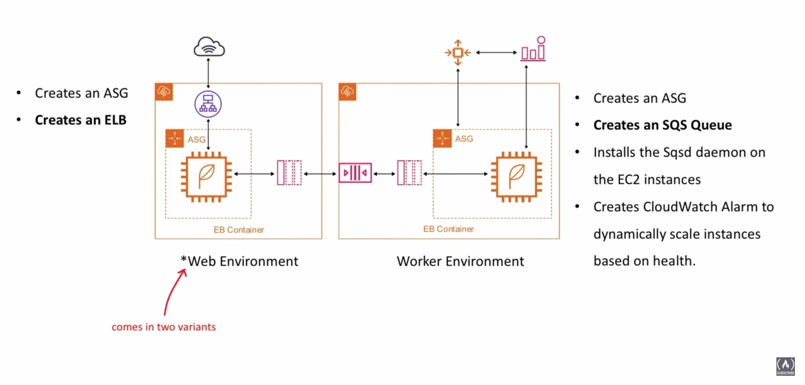

- Web Environment
  - Create an Auto Scaling Group
  - **Creates an Elastic Load Balancer**
- Worker Environment
  - Creates an Auto Scaling Group (ASG)
  - Creates an SQS Queue
  - Installs the Sqsd daemon on the EC2 instances
  - Creates CloudWatch Alarm to dynamically scale instances based on health
 
#### Web Environments

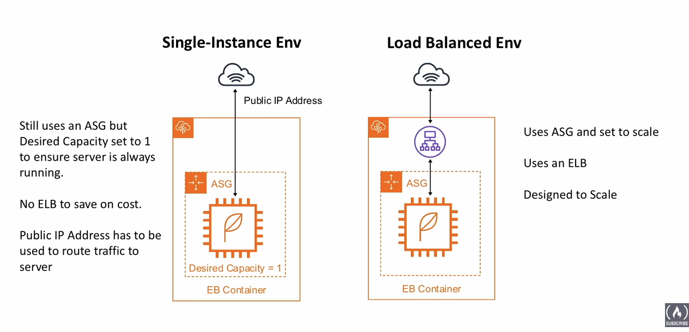

- Load Balanced Environment
  - Uses Auto Scaling Groups and set to scale
  - Uses and ELB
  - Designed to Scale
- Single-Instance Environment
  - Still uses an ASG but Desired Capacity set to 1 to ensure server is always running
  - No ELD to save on cost
  - Public IP Address has to be used to route traffic to server

#### Deployment Policies

- These are the Deployment Policies available with Elastic Beanstalk


| Deployment Policy        | Load Balanced Env           | Single Instance Env  |
| ------------- |:-------------:| -----:|
| All at once      | True | False |
| Rolling      | True      |   False |
| Rolling with additional batch | True      |    False |
| Immutable | True      |    True |

*Rolling and Rolling with additional batch unavailable in Single Instance env because you need an Elastic Load Balancer*

#### All At Once Deployment

1. Deploys the new app version to all instances at the same time
2. Takes all instances **out of service** while the deployment processes
3. Servers become available again

The **fastest** but most **dangerous** method
**In case of failure**
- You need to roll back the changes by re-deploying the original version again to all instances

#### Rolling

1. Deploys the new app version to a batch of instances at a time
2. Takes the batch's insntances **out of service** while the deployment process
3. Reattaches updated instances
4. Goes onto next batch, taking them out of service
5. Reattaches those instances (rinse and repeat)

#### Rolling with Additional Batch

1. Launch new instance thjat will be used to replace a batch
2. Deploy update app versiont to new batch
3. Attach the new batch and terminate the existing batch

Rolling with Addtional Batch's ensure our capacity is never reduced. **This is important for applications were a reduction in capacity could cause availability issues for users.**

**In case of failure**
- You need to perform an additional rolling update to roll back the changes

#### Immutable

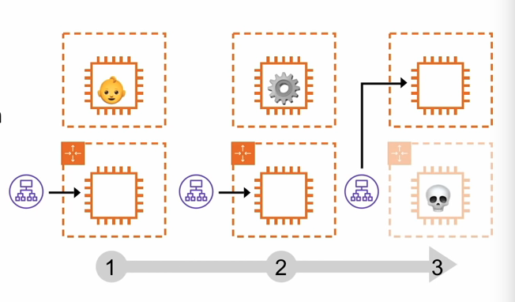

1. Create a new ASG group with EC2 instance
2. Deploy the updated version of the app on the new EC2 instances
3. Point the ELB to the new ASG and delete the old ASG which will terminate the old EC2

#### EB Deployment Methods


| Method        | Impact of failed deployment | Deploy time | No downtime | No DNS change | Rollback process | Code deployed to instances
| ------------- |:-------------:| :-----:|:-----:| :-----:|:-----:| :-----:|
| All at once   | Downtime | O    | False | True | Manual | Existing | 
| Rolling | Single batch out of service | OO*  | True | True | Manual | Existing |
| Rolling with additional batch |Minimal if first batch fails | OOO* | True | True | Manual | New and Existing |
| Immutable | Minimal | OOOO | True | True | Terminate New | New |
| Blue/Green | Minimal | OOOO | True | False | Swap URL | New |

* times may vary

#### In Place vs Blue Green Deployment

*In-Place and Blue/Green Deployment **are not definitive in definition** and the context can change the scope of what they mean*

- In-Place could mean within the scope of Elastic Beanstalk Env
All the deployment policies provided by EB could be considered In-Place since they are within the scope of a single EB environment
  - All at once
  - Rolling
  - Rolling with additional
  - Immutable
- In-Place could mean within the scope of the same server (not replacing the server)
Deployment policies with do not involve the server being replaced
  - All at once
  - Rolling
In-Place could mean within the scope of an uninterupted server
Traffic is never routed away from the server (taken-of-service). Implements Zer-downtime deploys where Blue/Greens accurs on the server
  - EB can't do this
  - Ruby on Rails + Unicorn is an example of this method
  
Blue/Green deployment in the context of Elastic Beanstalk

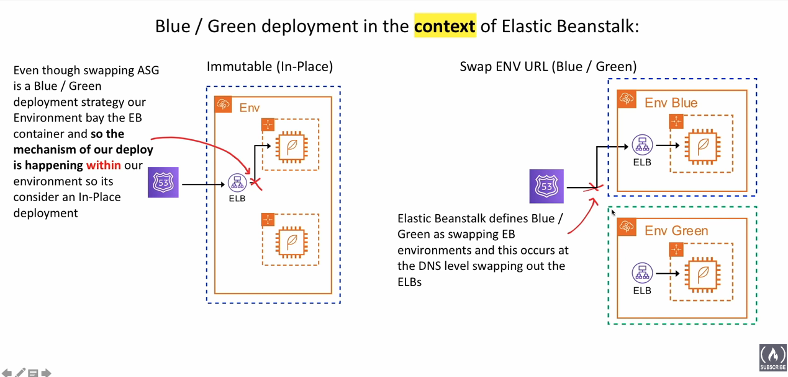

#### Configuration Files

- Elastic Beanstalk environments can be customized used configuration files
 - **.ebextensions** is a hidden folder called at the root of your project which contains the config files
 - **.config** is the extension for the config files which need to be stored in ebextensions
 
- Configuration files can config
  1. Option Settings
  2. Linux/Windows Server Configuration
  3. Custom Resources
  
#### Env Manifest

- The Environment manifest is a file called **env.yml** which is stored at the root of your project
When creating new Elastic Beanstalk environments this file allows you to configure the defaults such as:

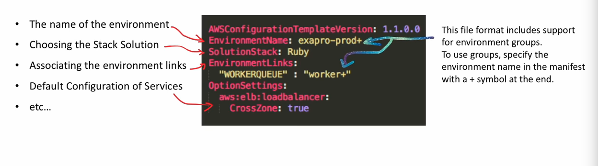

#### Linux Server Configuration

- Packages
  - download and install prepackaged applications and components
- Groups
  - create Linux/UNIX groups and to assign group IDs
- Users
  - create Linux/UNIX users
- Files
  - create files on the EC2 instance (inline or from URL)
- Commands
  - execute commands on the EC2 instance before app is setup
- Services
  - define which services should be started or stopped when the instance is launched
- Container Commands
  - execute commands that affect your application source code

#### EB CLI

The CLI is hosted on Github
You run these two commands to install

- Commands
  - **eb init** - configure your project directory and the EB CLI
  - **eb create** - create your first env
  - **eb create** - see the current status of your env
  - **eb** view health info about the instances and the state of your overall env (use --refresh to upddate every 10 seconds)
  - **eb events** - see a list of events output by EB
  - **eb logs** - pull logs from an instance in your env
  - **eb open** - open your env's website in a browser
  - **eb deploy** - once the env is running, deploy and update
  - **eb config** - take a look at the configuration optiuons available for your running env
  - **eb terminate** - delete the environment
  
  #### EB Custom Image
  
- When you create an EB environment, you can specify an dAMI to use instead of the standard EB AMI
- A custom AMI can improve provisioning times when instances are launched in your environment
- If you need to install a lot of software that isn't included in the standard AMIs

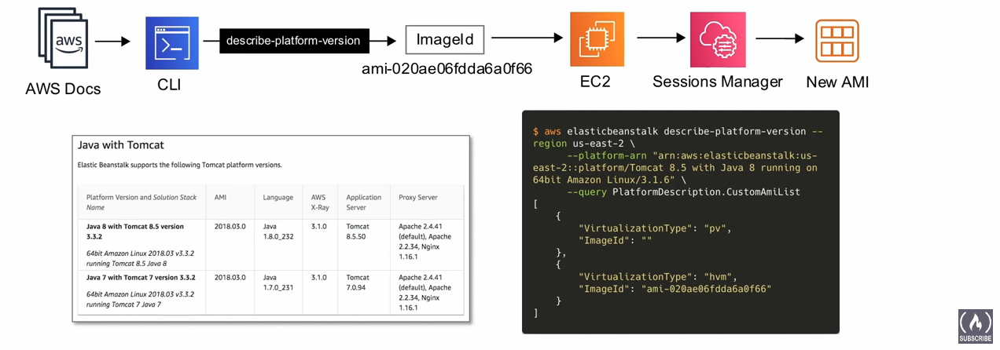

#### Configuration RDS

- A database can be added inside or outside your EB environment

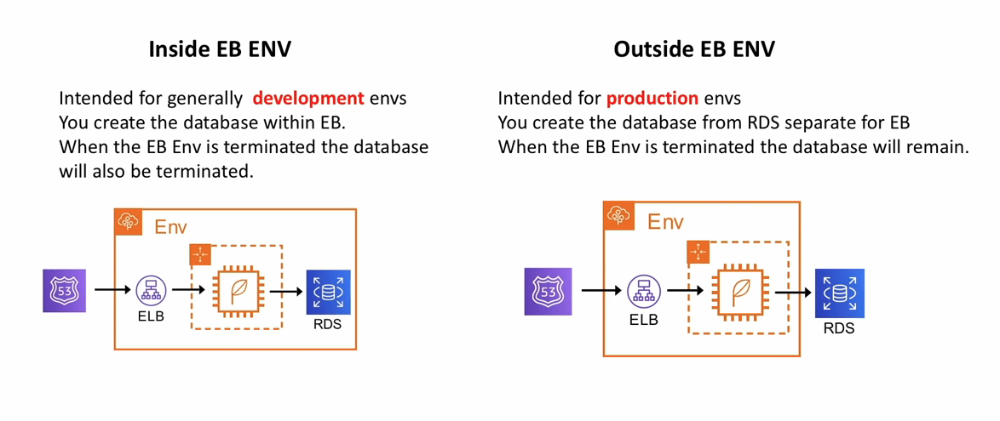

#### Elastic Beanstalk Cheat Sheet

- **Elastic Beanstalk** handles the deployment, from capacity provisioning, load balancing, auto-scaling to application health monitoring
- When you want to run a web-application but you don't wahnt to have to think about the underlying infrastructure
- It costs nothing to use Elastic Beanstalk (only the resources it provisions eg. RDS. ELB, EC2)
- Recommended for test or development apps. Not recommended for production use
- You can choose from the following preconfigured platforms: Java, .NET, PHP, Node.js, Python, Ruby, Go and Docker
- You can run containers on EB either in Single-container or Multi-container, these containers are running on ECS instead of EC2
- You can launch either a **Web Environment** or a **Worker Environment** 
  - **Web Environments** come in two types **Single-Instance** or **Load Balanced**
    - **Single-Instance Env** launches a single EC2 instance, an EIP is assigned to the EC2
    - **Load Balanced Env** launch EC2s behind an ELB managed by an ASG
  - **Worker Environments** creates an SQS queue, install the SQS daemon on the EC2 instances, and has ASG scaling policy which will add or remove instances based on queue size
- EB has the following **Deployment Policies**
  - **All at once** takes all servers out-of-service, applies changes, puts servers back-in-service, Fast, has downtime
  - **Rolling** updates servers in batches, reduced capacity based on batch size
  - **Rolling with additional batches** adds new servers in batches to replace old, never reduces capacity
  - **Immutable** creates the same amaount of servers, and switches all at once to new servers, removing old servers
- Rolling deployment policies require an **ELD** so cannot be used with Single-Instance Web Environments
- In-Place deployment is when deployment occurs whitin the environment, all deployment policies are In-Place
- Blue/Green is when deployment swaps environments (outside an environment), when you have external resources such as RDS which cannot be destroyed its suited for Blue/Green
- **bextensions**s a folder which contains all configuration files
- With EB you can provide **Custom Images** which can improve provisioning times
- If you let Elastic Beanstalk create the RDS instance, that means when you delete your environment it will delete the database. This setup is inteded for development and test environments
- **Dockerrun.aws.json** is similar to an ECS Task Definition files and defines multi-container configuration


[back to top](#table-of-contents)

---

## Elastic Beanstalk Follow Along

#### Cloud9 Setup

- Make sure you are in the right region!
- Create a developer environment in Cloud9 through the AWS console

#### Security Groups

Once you have your web application we will need to open up the ports
- By default Cloud9 have ports 8080, 8081, 8082 open
1. Identify the MAC Address with `curl -s http://169.254.169.254/latest/meta-data/mac`
2. Find the security group using `curl -s http://169.254.169.254/latest/meta-data/network/interfaces/macs/**yourMacId**/security-group-ids`
3. Find your IP address by going to http://checkip.amazonaws.com/
4. We will need the IP address to add to the cidr block
5. Use the command `aws ec2 authorize-security-group-ingress --group-id **yourSecurityGroupID** --port 8080 --protocol tcp --cid **yourIP**/32`
*the /32 at the end. 
5. Use the command `aws ec2 authorize-security-group-ingress --group-id **yourSecurityGroupID** --port 8080 --protocol tcp --cidr **yourIP**/32`
*The /32 at the end of the cidr block is important because it says only this IP address*
6. Check that your Security Group has been edited `aws ec2 describe-security-groups --group-ids **yourSecurityGroupID**  --output text --filters Name=ip-permission.to-port,Values=8080`
7. If the Security Group is not set nothing would show otherwise it should look something like this:
```
SECURITYGROUPS  Security group for AWS Cloud9 environment aws-cloud9-DevEnv-08e6543c08554c57a272f337df0f96df sg-0938552a4807d9570    aws-cloud9-DevEnv-08e6543c08554c57a272f337df0f96df-InstanceSecurityGroup-2AM4ALIQ5DHX        540908314583    vpc-fdd1c687
IPPERMISSIONS   8080    tcp     8080
IPRANGES        76.126.6.216/32
IPPERMISSIONS   22      tcp     22
IPRANGES        35.172.155.192/27
IPRANGES        35.172.155.96/27
IPPERMISSIONSEGRESS     -1
IPRANGES        0.0.0.0/0
TAGS    aws:cloud9:owner        AIDAX34FF37LSKQTQVJES
TAGS    aws:cloudformation:stack-id     arn:aws:cloudformation:us-east-1:540908314583:stack/aws-cloud9-DevEnv-08e6543c08554c57a272f337df0f96df/1a523520-ac14-11ea-b406-0e706f74ed45
TAGS    aws:cloudformation:logical-id   InstanceSecurityGroup
TAGS    Name    aws-cloud9-DevEnv-08e6543c08554c57a272f337df0f96df
TAGS    aws:cloudformation:stack-name   aws-cloud9-DevEnv-08e6543c08554c57a272f337df0f96df
TAGS    aws:cloud9:environment  08e6543c08554c57a272f337df0f96df
```
8. Next find the public ip with the command `curl -s http://169.254.169.254/latest/meta-data/public-ipv4`
9. Run your web application and check to see if it runs at the IP and port 8080 (eg. 54.165.37.183:8080)
10. Add your project to a Git repo

#### EB CLI Setup

1. We will download the EB CLI following the directions here: https://github.com/aws/aws-elastic-beanstalk-cli-setup
2. Make sure to add the eb cli to PATH given their recommended command `echo 'export PATH="/home/ec2-user/.ebcli-virtual-env/executables:$PATH"' >> ~/.bash_profile && source ~/.bash_profile` and `echo 'export PATH=/home/ec2-user/.pyenv/versions/3.7.2/bin:$PATH' >> /home/ec2-user/.bash_profile && source /home/ec2-user/.bash_profile` if you are using bash

#### EB init

Once you have the EB CLI installed
1. Check to make sure you have the cli by using the command `eb`
  - If you see a long list of possible commands, you have the cli
2. To initialize the project use the command `eb init`
  - You will find several prompts to help set up the elastic beanstalk environment

#### EB Config

Configurations of the EB environment depends on the type of environment and can be found in the **.ebextensions** directory. This is not created by `eb init` therefore you will have to create one yourself.
1. Create the directory using `mkdir .exextensions`
2. Go into the directory
3. Create a config file
Here is an example of what one might look like:
```
option_settings:
    aws:elasticbeanstalk:application:environment:
        PORT: 8081
        NODE_ENV: production
```

#### EB Create

We will now create our EB environment
1. Run the `eb create --single` command
  - The `--single` is important, otherwise EB will spin up ELB which costs money!
2. It will prompt you with several options
  - Environment Name
  - DNS CNAME prefix
  - Enable Spot Fleet requests
3. The environment should be created as long as there are no errors in the config files
4. Run `eb status` to check the health of the environment

#### Immutable Deployment

We will now try an immutable deploy
1. go into **.ebextensions**
2. create a new config file which should look something like this:
```
option_settings:
    aws:elasticbeanstalk:command:
        DeploymentPolicy: Immutable
        HealthCheckSuccessThreshold: Warning
        IgnoreHealthCheck: true
        Timeout: "600"
```
3. Make sure to add the changes to git (CodeCommit for this example) and push
4. Then to deploy run `eb deploy`

To remove the immutable deploy settings, simply delete the config file in **.ebextensions** and push your changes

#### Blue Green Deployment

To do a Blue/Green deploy we will first need to create a clone of our EB environment. This can be done easily on the AWS concole but we will do this through the command line.
*We will refer to the original environment as blue and the cloned environment as green*
1. First run `eb clone` which will clone your current environment to create your green environment. There will be several prompts
  - Name for the new environment
  - DNS CNAME prefix
2. Once the green environment is created you can deploy to that environment using `eb deploy <name of the green environment>`
3. Next we will swap the urls so that the traffic is redirected to the cloned environment using `eb swap <name if blue environment --destination_name <name of green environment>`
4. The green environment should have the url of the blue environment
5. Once you have confirmed that the green environment is using the blue url we can now terminate the blue environment using `eb terminate <name of blue environment>`

#### Docker Single

#### Single Docker Container with ECR

0. Before we start, make sure to create an ECR Repository in the console which would look sometimg like `<your-account-number>.dkr.ecr.us-east-1.amazon.com/<add-your-project-name-here>`
0.5 Also before we start, make sure to attach Permissions for the EC2 to have access to ECR
  1. Go to the IAM console
  2. Go to Roles
  3. Go to EC2 Roles
  4. Click *Attach Roles*
  5. Look for **AmazonEC2ContainerRegistryReadOnly** and attach
1.  Create a Dockerrun.aws.json with the command `docker build -t <name-of-project> .` This will create a Docker image
2. Authenticate to ECR using `aws ecr get-login-password | docker login --username AWS --password-stdin <your-account-number>.dkr.ecr.us-east-1.amazon.com`. This will create a token for ECR (stored as `/home/ec2-user/.docker/config.json`
3. Next we will find the docker image id with the command `docker images`
4. Find the associated Docker image id with the repository you've created with the `docker build` command.
5. Next add the tag to docker with `docker tag <image-id> <account-number>.dkr.ecr.us-east-1.amazon.com/<your=project>`
6. Then run `docker push <account-number>.dkr.ecr.us-east-1.amazon.com/<your-project>` to push your Docker image to ECR
7. Then create a new directory (e.g. <your-project>-external)
8. Create within that create a json file called `Dockerrun.aws.json`
An example of what a Dockerrun.aws.json might look like:
```
{
  "AWSEBDockerrunVersion": "1",
  "Image": {
    "Name": "<account-number>.dkr.ecr.us-east-1.amazon.com/<your-project>"
  },
  "Ports": [{
    "ContainerPort": 8080,
    "HostPort": 8080
  }]
}
```
9. Once you have your `Dockerrun.aws.json` you can go ahead and go through the steps of creating your environment/instance with Elastic Beanstalk as we have done before (eg. `eb init`, `eb create --single`, etc.)


 [back to top](#table-of-contents)

---

## Elastic Container Service

Fully-managed **container** orchestration service. 
Highly secure, reliable, and scalable way to run containers./

#### Components of ECS


- Cluster
  - Multiple EC2 instnances which will house the docker containers
- Task Definition
  - A JSON fole that defines the configuration of (up to 10) containers you want to run
- Task
  - Lauches containers defined in Task Definition. Tasks do not remain running once workload is complete
- Service
  - Ensures tasks remaining running
- Container Agent
  - Binary on each EC2 instnace which monitors, starts and stops them
 
#### Creating an ECS Cluster

Create a Cluster
- Use Spot or On Demand
- EC2 instance type
- Number of Instances
- EBS Storage Volume
- EC2 can be Amazon Linux 2 or Amazon Linux 1
- Choose a VPC or create new
- Assign an IAM Role
- Option to turn on CloudWatch Container Insights
- *Choose key pair
- EC2 Linux + Networking
  - Cluster
  - VPC
  - Subnets
  - Auto Scaling group with Linux AMI

#### Task Definition JSON File Example

Create new Task Definition
- You can definte multiple containers within a task definition.
- The Docker images can be provided either via ECR or an official docker repository eg. Docker Hub
- You must have one essential container. Of this container fails or stops then all other containers will be stopped.
- AWS had a wizard to create Task Definitions instead having to create a file by hand

#### Elastic Container Registry


A full-managed Docker container registry that makes it easy for developers to store, manage, and deploy Docker container images.

#### Creating an ECS Service

First start by creating an `ecsInstanceRole` by going to IAM
1. Create a new Role for EC2 by selecting `Amazon Service` and `EC2`
2. Select the `AmazonEC2ContainerServiceforEC2Role`
3. Finish creating that Role
4. Also go ahead and create an `ecsTaskExecutionRole` as well

We will then create an ECS Cluster
1. Go to the ECS service through the console.
2. Create a Cluster (Careful not to select Fargate, which will not create a Cluster)
3. It will spin up several services sich as an instance, security group, EC2 route, Auto scaling group, etc.
4. Once created, create a new Task Definition through the menu on the left
5. You will need to specify a Task Memory
6. Make sure to add a container as well as the image repo from ECR
7. Make sure to map the ports (Host port and Container port)
8. Also make sure to attach a Task role and you should be good to go

Once you have your Cluster let's create a Service
1. Click the create button under the Service tab
2. Make sure to select EC2 and go through the prompts

---

## Fargate

#### Introduction to Fargate

Serverless containers where you run containers and pay based on duration and consumption.

- You can create an emprt ECS cluster (no EC2's provisioned) and then launch Tasks as Fargate
- You no longer have to **provision**, **configure** and **scale** clusters of EC2 instances to run containers
- You are charged for at least one minute and after its by the second
- You pay based on duration and consumption

#### Configuring Fargate Tasks

- In your Fargate Task Definition you **define** the **memory** and **vCPU**
- You will then add your containers and **allocate** the memory and vCPU required for each
- When you run the Task you can choose what VPC and subnet it will run in
- **Apply a Security Group to a Task**
- Apply an IAM role to the Task
*You can apply a Security Group and IAM role for both ECS and Fargate Tasks and Services*

#### Fargate vs Lambda

|             | Fargate                                        | Lambda                                               |
| ----------- |:----------------------------------------------:| ----------------------------------------------------:|
| Cold starts | Yes (shorter)                                  | Yes                                                  |
| Duration    | As long as you want                            | **15 mins**(max)                                     |
| Memory      | Up to **30GB**                                 | Up to **3 GB**                                       |
| Containers  | You provide your own containers                | Limited to standardized containers                   |
| Integration | More manual labor                              | Seamlessly integrates with other serverless services |
| Pricing     | Pay at least 1 min and every additional second | Pay per 100ms                                        |

#### Creating a Fargate Service

Before creating a Fargate Service make sure you have a Docker image created (Find directions in previous notes)
1. Go to the ECS console
2. Create a Cluster and select Network only (It will say **Powered by AWS Fargate**)
3. Go through the prompts and it will create a Cluster without any server running
4. Next create a Task Definition selecting Fargate
5. Make sure you have a Task Role with Execution permissions selected
6. Make sure to add the Docker image by clicking on add a container
7. You will need to set the amount of memory to allocate as well as the ports
8. Once the Task Definition is created we will create a Service
9. Follow the prompts, making sure to select the Cluster VPC, subnet, whether to use a Load Balancer, etc.
10. For production, make sure to configure the Securty Group (remember Security Groups are configured on the Task level)

#### ECS and Fargate Cheatsheet

- **Elastic Container Service (ECS)** is a fully-managed container orchestration service. Highly secure, reliable, and scalable way to run containers
- Components of ECS
  - **Cluster** - Multiple EC2 instances which will house the docker containers
  - **Task Definition** - A JSON file that defines the configuration of (up to 10) containers you want to run
  - **Task** - Launches containers defined in a Task Definition. Tasks do not remain running once workload is complete.
  - **Service** - Ensures tasks remain running eg. a web-app
  - **Container Agent** - Binary on each EC2 instance which monitors, starts and stops tasks
  
- **Elastic Container Registry (ECR)** - A fully-managed Docker container registry that makes it easy for developers to **store**, **manage**, and **deploy** Docker container images (Like a git for docker)

- **Fargate** are **Serverless containers**.
  - You don't have to worry about servers. You just run the containers and pay based on duration and consumption
  - Fargate has **Cold Starts** so if this is an issue for you then use ECS
  - **Duration** - as long as you want
  - **Memory** - can go up to 30 GB
  - **Pricing** - pay at least 1 min and every additional second
  
## X-Ray

Helps developers **analyze and debug** applications utilizing **microservices** architecture

#### Introduction to X-Ray

**What is a Micro-service architecture?**
- Microservices is an architectural and organizational approach to software development where software is composed of **small independent** services that communicate over well-defined APIs.
- These services are owned by small, self-contained teams.
- Microservice architectures make applications easier to scale and fater to develop, enabling innovation and accelerating time-to-market for new features.

**What is a Distributed Tracing?**
- Distributed tracing, also called distributed request tracing, is a method used to profile and monitor apps, especially those build using a microservices architecture. Distrubutred tracing helps pinpoint where failures occur and what causes **poor performance**

**What is Performance Monitoring?**
- Monitoring and management of performance and availability of software apps. APM strives to detect and diagnose complex application performance problems to maintain an expected level of service.

*Similar third-party service to X-Ray*
- DataDog
- New Relic
- SignalFX
- Lumigo

X-Ray is a Distributed Tracing System
- Collets data about requests that your application serves
- View, filter collected data to identify **issues** amd avenues for **optimization**

For any traced request to your application, you can see detailed information not only about the request and response, but also about calls that your application makes to downstream AWS resources, microservices, and databases and HTTP web APIs.

#### Anatomy of X-Ray

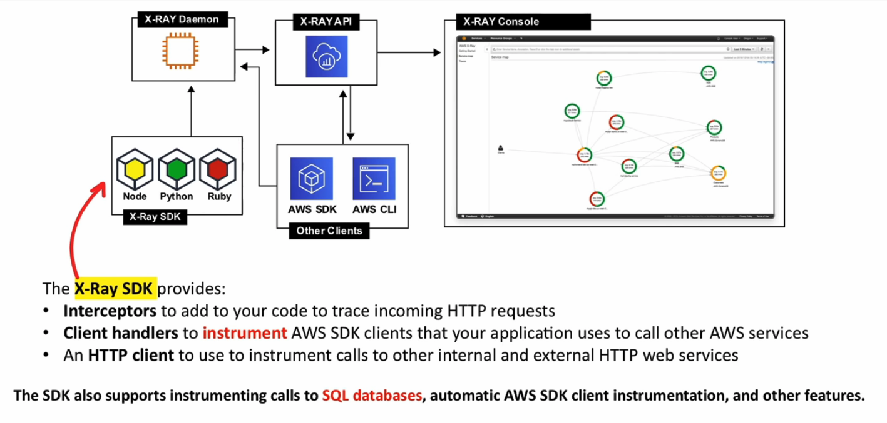

#### Instrumentation

**What is Instrumenting?**
- The ability to monitor or measure the level of a product's performance, to diagnose errors and to write trace information. (logging information in X-Ray)

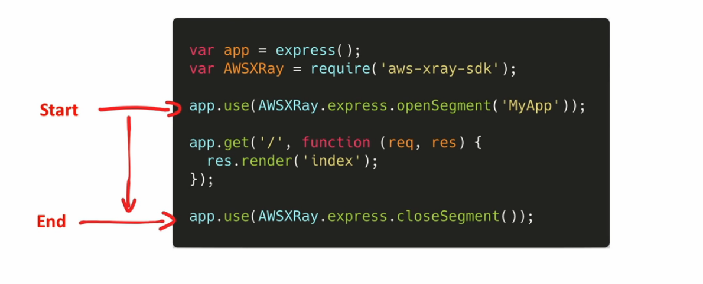

#### X-Ray Daemon

- Instead of sending trace data directly to X-RAy, the SDK sends **JSON segment documents** to a deamon process listening for UDP traffic.
- The X-Ray daemon **buffers segments** in a queue and uploads them to X-Ray in batches.
- The daemon is available for Linux, Windows, and Mac, and is included on Elastic Beanstalk and Lambda platforms
- X-Ray uses trace data from the AWS resources that power your cloud applications to generate a detailed **service graph**

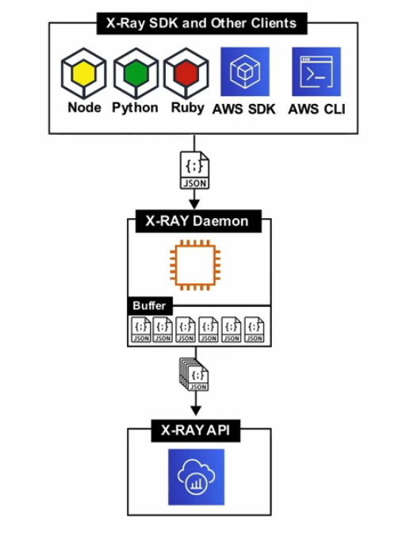

#### X-Ray Concepts

- AWS X-Ray received data from services as **services**
- X-Ray then groups segments that have a common request into **traces**
- X-Ray processes the traces to generate a **service graph** that provides a visual representation of your app.
  - Segments
  - Subsegments
  - Service Graph
  - Traces
  - Sampling
  - Tracing Header
  - Filter Expressions
  - Groups
  - Annotations and Metadata
  - Errors, Faults, and Exceptions
  
#### Service Graph

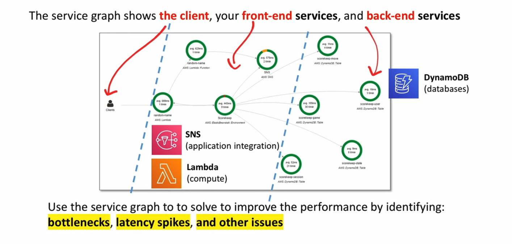

#### Segments

- The compute resources running your application logic **send data** about their work as **segments**
- A segment can send the following information:
  - **The host** - hostname, alias or IP address
  - **The request** - method, client address, path, user agent
  - **The response** - status, content
  - **The work done** - start and end times, subsegments
  - **Issues that occur**  - erros, faults and exceptions, including automatic capture of exception stacks
  
#### Subsegments

- Subsegments provide more granular timing information and details about downstream calls that your app made to fulfill the original request
- A subsegment can contain additional details about a call to an AWS service, an external HTTP API, or an SQL database

*You can even **define arbitrary subsegments** to instrument specific functions or lines of code in your application*

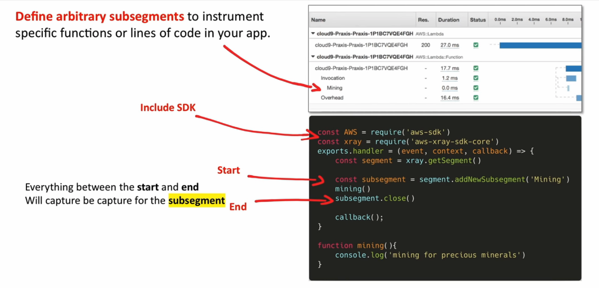

#### Traces

- A trace collects all segments generated by a single request
- A **trace ID** tracks the path of a request through your application
- The first supported service that the HTTP request interacts with **adds a trace ID header** to the **request**, and propagates it downstream to track the latency, disposition, and other request data

*Not every trace is recorded*

#### Sampling

- The X-Ray SDK uses a **sampling algorithm** to determine which requests get traced
- By **default**, the X-Ray SDK records **the first request each second**, and **5% of any additional requests** (to avoid incurring services charges when you are getting started, the default sampling is low)
- You can modify the default sampling rule and Add additional sampling rules.


