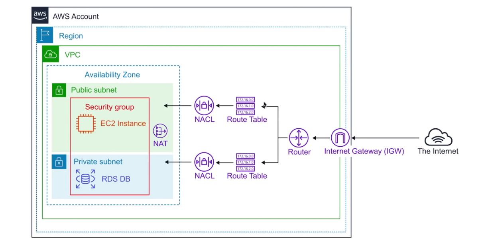
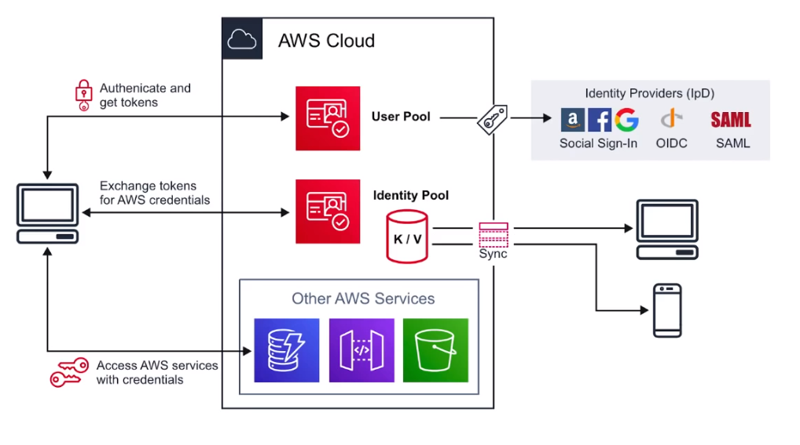
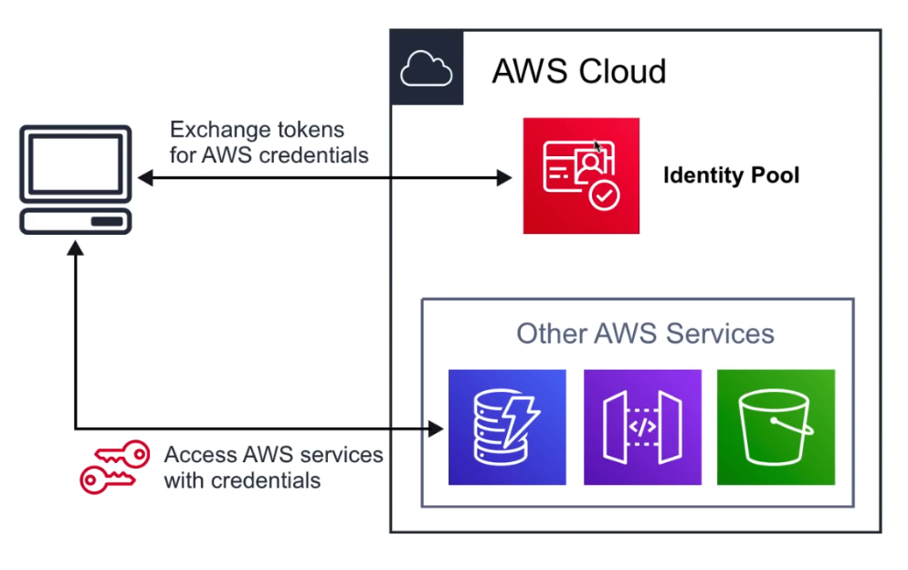
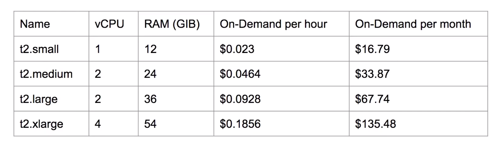

# AWS Certified Cloud Practitioner

## Table of Contents

- [FAQ](#faq)
- [Exam Guide Overview](#exam-guide-overview)
- [S3](#s3)
- [AWS Snowball](#aws-snowball)
- [Virtual Private Cloud](#virtual-private-cloud)
- [IAM](#iam)
- [Cognito](#cognito)
- [Command Line Interface](#command-line-interface)
- [DNS](#dns)
- [Route 53](#route-53)
- [EC2](#ec2)

---

## FAQ

#### Why get AWS Solutions Architect Associate?

- Finding creative solutions by leveraging cloud services instead of reinventing the wheel. Big picture thinking.
- Shows you have broad knowledge across many domains.
- Great for those who get bored easily since you need to wear multiple hats.
- It's less about the "how are we going to implement this? and more about the "what are we going to implement?
- Not uncommon to be part of business development team, might need to ban extrovert with charismatic speaking skills.

#### Who is the Solution Architect Associate for?

- Architectue Diagrams
- Constant Learning
- Pricing
- Security

#### What value does Solution Architect Associate hold?

- The _most popular_ AWS certification.
- In demand with startups because you can help wherever help is needed.
- Recognized as the _most important_ certification at the associate level.
- Will help you _stand out_ on resumes.
- _Not likely to increase your salary_ but more job opportunities.

#### Still not sure why?

- Most in-demand.
- Not too easy but not too hard.
- Requires least amount of technical knowledge.
- When in doubt which cert to take, since it provides most flexible learning path.
- If you're new to Cloud Computing, take the CCP and then Solution Architect Associate.

#### How long to study to pass Solution Architect Associate

- If you're a developer... 1 month of study.
- If you're a bootcamp grad... 1-2 months of study.
- If you're a cloud engineer... 20 hours of study.

#### How much, how long, how many questions?

- \$150
- 130 minutes
- 65 questions
- ~72% passing score
- Valid for 3 years

---

## Exam Guide Overview

- Design resilient architectures - 34%
  - Choose reliable/resilient storage.
  - Determine how to design decoupling mechanisms using AWS services.
  - Determine how to design a multi-tier achitectural.
    solution.
  - Determine how to design high availability and/or fault tolerant architecture.
- Design performant architectures - 24%
  - Choose performant storage and database.
  - Apply caching to improve performance.
  - Design solutions for elasticity and scalability.
- Specify secure applications and architectures - 26%
  - Determine how to secure application tiers.
  - Determine how to secure data.
  - Define the networking infrastructure for a single VPC application.
- Design cost-optimized architectures - 10%
  - Determine how to design cost-optimal storage.
  - Determine how to design cost-optimal compute.
- Define operationally-excellent architectures - 6%
  - Choose design features in solutions that enable operational resilience.

Whitepapers

Read _AWS Well-Achitected Framework_.
Read _Architecting for the Cloud: AWS Best Practices_.

---

## S3

#### Introduction to S3

- Object-based storage service.
- Serverless storage in the cloud.
- Don't worry about filesystems or disk space.

**What is Object Storage (Object-based Storage)?**

- data storage architecture that manages data as objects, _as opposed_ to other storage architectures:
  - file systems - manages data as files and file hierarchy.
  - block storage - manages data as blocks within sectors and tracks.

S3 provides you with unlimited storage. You do not need to think about the underlying infrastructure.
The S3 console provides an interface for you to uploaad and access your data.

##### S3 Object

Objects contain your data. They are like files.
Objects may consist of:

- Key - name of object.
- Value - the data itself made up of a sequence of bytes.
- Version ID - when versioning available, the version of object.
- Metadata - additional information attached to the object.

You can stre data from _0 Bytes_ to _5 Terabytes_ in size.

##### S3 Bucket

Buckets hold objects. Buckets can also have folders which in turn hold objects.
S3 is a a universal namespace so bucket names must be unique (think like having a domain name).

---

#### Storage Classes

Trade Retrieval Time, Accessibilty and Durability for Cheaper Storage.

```
11 9's = 99.99999999999
 9 9's = 99.999999999
```

|                Class                |                                                                                        Description                                                                                        |
| :---------------------------------: | :---------------------------------------------------------------------------------------------------------------------------------------------------------------------------------------: |
|         Standard (default)          |                                                      Fast! 99.99% availability, 11 9's durability, replicated across at least 3 AZs.                                                      |
|         Intelligent Tiering         | Uses ML to analyze your object usage and determine the appropriate storage class. Data is moved to the most cost-effective access tier, without any performance impact or added overhead. |
| Standard Infrequently Accessed (IA) |                    Still Fast! Cheaper if you access files less than once a month. Additional retrieval fee is applied. 50% less than standard (reduced availability).                    |
|             One Zone IA             |              Still Fast! Objects only exist in one AZ. Availability is 99.5% but cheaper than Standard IA by 20% less. Data could get destroyed. A retrieval fee is applied.              |
|               Glacier               |                                    For long-term storage cold storage. Retrieval of data can take minutes to hours but the off is very cheap storage.                                     |
|        Glacier Deep Archive         |                                                              The lowest cost storage class. Data retrieval time is 12 hours.                                                              |

**S3 Guarantees**

- Platform is built for 99.99% availability.
- Amazon gaurantees 99.9% availability.
- Amazon guarantees 11 9's of durability.

---

#### S3 Security

- All new buckets are **PRIVATE** when created by default.
- Logging per request can be turned on in a bucket. Log files are generated and saved in a different bucket (even a bucket in a different AWS account if desired).
- Access control is configured using **Bucket Policies** and **Access Control Lists (ACL)**.

---

#### S3 Encryption

**Encryption In Transit**

- Traffic between your local host and S3 is achieved via SSL/TLS.

**Server Side Encryption (SSE) - Encryption At Rest**

- Amazon helps you encrypt the object data.
- S3 Managed Keys - (Amazon manages all the keys).
- SSE-AES - S3 handles the key, uses AES-256 algorithm.
- SSE-KMS - Envelope encryption, AWS KMS and you manage the keys.
- SSE-C - Customer provided key (you manage the keys).

**Client-Side Encryption**

- You encrypt your own files before uploading them to S3.

---

#### Data Consistency

**New Objects (PUTS)**

- _Read After Write_ consistency.
- When you upload a new S3 object, you able to read immediately after writing.

**Overwrite (PUTS) or Delete Objects (DELETES)**

- _Eventual_ consistency.
- When you overwrite or delete an object, it takes time for S3 to replicate versions to AZs.
- If you read immediately, S3 may return you an old copy. You need to generally wait a few seconds before reading.

---

#### Cross Region Replication (CRR)

- When enabled, any object that is uploaded will be _automatically replicated_ to another region(s).
- Provides higher durability and potential disaster recovery for objects.
- You must have _versioning_ turned on both the _source_ and _destination_ buckets.
- You can have CRR replicate to another AWS account.

---

#### S3 Versioning

- Store all versions of an object in S3.
- Once enabled, it cannot be disabled, only suspended in bucket.
- Fully integrates with S3 Lifecycle rules.
- MFA Delete feature provides extra protection against deletion of your data.

---

#### S3 Lifecycle Management

- Automate the process of moving objects to different Storage classes or deleting objects all together.
- Can be used togethe with _versioning_.
- Can be applied to both _current_ and _previous_ versions.

---

#### Transfer Acceleration

- Fast and secure transfer of files _over long distances_ between your end users and an S3 bucket.
- Utilizes _CloudFront's_ distributed Edge Locations.
- Instead of uploading to your bucket, users use a _distinct URL_ for an Edge Location.
- As data arrives at the Edge Location it is automatically routed to S3 over a specially optimized network path(Amazon's backbone netowrk).

---

#### Presigned URLs

- Generate a URL which provides you temporary access to an object to either upload or download object data. Presigned URLs are commoonly used to _provide access to private objects_. You can use AWS CLI or AWS SDK to generate Presigned URLs.
- For example, you have a web app which needs to allow users to download files from a password-protected area. Your web app generates a presigned URL which expires after 5 seconds. The user downloads the file.

---

#### MFA Delete

- **MFA Delete** ensures users cannot delete objects from a bucket unless they provide their MFA code.
- MFA Delete can only be enabled under these conditions:
  - The _AWS CLI_ must be used to turn on MFA.
  - The bucket must have _versioning turned on_.

Only the bucket owner logged in as **Root User** can DELETE objects from bucket.

---

### AWS Snowball

- Petabyte-scale data transfer service.
- Move data onto AWS via physical briefcase computer.

#### Snowball

- Low Cost - it cost thousands of dollars to transfer 100TB over high speed internet. Snowball can reduce that costs by _1/5th_.
- Speed - It can take 100TB over 100 days to transfer over high speed internet. Snowball can reduce that transfer time by _less than a week_.
- Snowball features and limitations:
  - E-Ink display (shipping info).
  - Tamper and weather proof.
  - Data is encrypted end-to-end (256-bit encryption).
  - Uses Trusted Platform Module (TPM) - a specialized chip on an endpoint device that stores RSA encryption keys specific to the host system for hardware authentication.
  - For security purposes, data transfers must be completed within _90 days_.of the Snowball being prepared.
  - Snowball can Import and Export from S3.
- Snowballs come in 2 sizes:
  - 50 TB (42 TB of usable space)
  - 80 TB (72 TB of usable space)

---

#### Snowball Edge

- Petabyte-scale data transfer service.
- Move data onto AWS via physical briefcase computer.
- Move storage and on-site compute capabilities.

Similar to Snowball but with _more storage_ and with _local processing_.

Snowball Edge features and limitations:

- LCD diplay (shipping information and other functionality).
- Can undertake local processing and edge-computing workloads.
- Can use in a cluster in groups of 5 to 10 devices.
- Three options for device configurations:
  - Storage optimized (25 vCPUs)
  - Compute optimized (54 vCPUs)
  - GPU optimized (25 vCPUs)

Snowball Edge comes in 2 sizes:

- 100 TB (83 TB of usable space)
- 100 TB Clustered (45 TB per node)

---

#### Snowmobile

A _45-foot long_ ruggedized _shipping container_, pulled by a _semi-trailer truck_.
Transfer up to _100PB_ per Snowmobile, exabyte-scale migration.

AWS personnel will help you connect your network to the snowmobile and when data transfer is complete, they'll drive it back to AWS to import into S3 or Glacier.

Security Features

- GPS Tracking
- Alarm monitoring
- 24/7 video surveillance
- An escort security while in transit (optional)

---

#### Virtual Private Cloud

#### Introduction

Provision a _logically isolated section of the AWS cloud_ where you can launch AWS resources in a virtual network that you define.

---

#### Core Components

Think of a AWS VPC as your own _personal data center_.
Gives you complete control over your virtual networking environment.



Combining these components and services is what makes up your VPC:

- Internet Gateway (IGW)
- Virtual Private Gateway (VPN Gateway)
- Routing Tables
- Network Access Control Lists (NACLs) - Stateless
- Security Groups (SG) - Stateful
- Public Subnets
- Private Subnets
- Nat Gateway
- Customer Gateway
- VPC Endpoints
- VPC Peering

---

#### Key Features

- VPCs are _Region Specific_; they do not span regions.
- You can create up to _5 VPC_ per region.
- Every region comes with a default VPC.
- You can have _200 subnets_ per VPC.
- You can use _IPv4 CIDR Block_ and in addition to a _IPv6 CIDR Blocks_ (the address of the VPC).
- Cost nothing: VPC's, Route Tables, NACLs, Internet Gateways, Security Groups and Subnets, VPC Peering
- Some things cost money: NAT Gateway, VPC Endpoints, VPN Gateway, Customer Gateway
- DNS hostnames (should our instance have domain name addresses)

---

#### Default VPC

AWS has a default VPC in every region so you can immediately deploy instances.

- Create a VPC with a size /16 IPv4 CIDR block (172.31.0.0/16)
- Create a size /20 default subnet in each AZ.
- Create an Internet Gateway and connect it to your default VPC.
- Create a default network access control list (NACL) and associate it with our default VPC.
- Associate the default DHCP options set for your AWS account with your default VPC.
- When you create a VPC, it automatically has a main route table.

---

#### Default Everywhere IP

- 0.0.0.0/0 is also known as default.
- It represents all possile IP addresses.
- When we specify 0.0.0.0/0 in our route table for IGW we are allowing internet access.
- When we specify 0.0.0.0/0 in our security groups inbound rules we are allowing all traffic from internet access our public resources.
- When you see 0.0.0.0/0, just think of giving access from anywhere on the internet.

---

#### VPC Peering

VPC Peering allows you to connect one VPC to another over a direct network route using private IP addresses.

- Instances on peered VPCs behave just like they are on the same network.
- Connect VPCs across same or different AWS accounts and regions.
- Peering uses a Star Configuration: 1 Central VPC - 4 other VPCs.
- No Transitive Peering (peering must take place directly between VPCs)
  - Needs a one to one connect to immediate VPC.
- No Overlapping CIDR Blocks.

---

#### Route Tables

- Route tables are used to determine where network traffic is directed.
- Each subnet in your VPC _must be associated_ with a route table.
- A subnet can only be associated with one route table at a time, but you associate multiple subnets with the same route table.

---

#### Internet Gateway (IGW)

- The IGW allows your VPC access to the internet.
- The IGW does 2 things:
  - provide a target in your VPC route tables for internet-routable traffic.
  - perform network address translation (NAT) for instances that have been assigned public IPv4 addresses.
- To route out to the internet, you need to add in your route tables for the IGW and set the destination to 0.0.0.0/0.

---

#### Bastion/Jumpbox

Bastions are EC2 instances which are security harden. They are designed to help you gain access to your EC2 instances via SSH or RCP that are in a _private subnet_.

They are also known as Jump boxes because you are jumping from one box to access another.

NAT Gateways/Instances are only intended for EC2 instances to gain outbound access to the internet for things such as security updates. NATs cannot/should not be used as Bastions.

System Manager's Sessions Manager replaces the need for Bastions.

---

#### Direct Connect

AWS Direct Connect is the AWS solution for establishing dedicated network connections from on-premises locations to AWS.

- Very fast network (lower bandwidth 50M - 500M or higher bandwidth (1GB or 10GB))
- Helps reduce network costs and increase bandwich thoughput (great for high traffic networks)
- Provides a more consistent network experience than a typical internet-based connection (reliable and secure)

---

#### VPC Endpoints

Think of a secret tunnel where you don't have to leave the AWS network.

VPC Endpoints allow you to _privately connect your VPC to other AWS services_.

- Eliminates the need for an Intnet Gateway, NAT device, VPN connection, or AWS Direct Connect connections.
- Instances in the VPC do not require a public IP address to communicate with service resources.
- Traffic between your VPC and other services _does not leave the AWS network_.
- Horizontally scaled, redundant and highly available VPC component.
- Allows secure communication between instances and services - without adding availaility risks or bandwidth constraints on your traffic.

There are 2 Types of VPC Endpoints:

- Interface Endpoints
- Gateway Endpoints

---

#### Interface Endpoints

Interface Endpoints are Elastic Network Interfaces (ENI) with a private IP address. They serve as an entry point for traffic going to a supported service.

Interface Endpoints are powered by AWS PrivateLink.

- Pricing per VPC endpoint per AZ (\$/hour) 0.01.
- Pricing per GB data processed (\$) 0.01.
- ~7.5/mo

---

#### Gateway Endpoints

A Gateway Endpoint is a gateway that is a target for a specific route in your route table, used for traffic destined for a supported AWS service.

- VPC GE's are free!
- To create a Gateway Endpoint, you must specify the VPC in which you want to create the endpoint, and the service to which you want to establish the connection.
- AWS Gateway Endpoint currently only supports 2 services: S3 and DynamoDB

#### VPC Flow Logs Introduction

VPC Flow Logs allow you to capture IP traffic information in-and-out of Network Interfaces within your VPC.

Flow Logs can be created for:

- VPC
- Subnets
- Network Interface

All log data is stored and accesible using Amazon CloudWatch Logs or S3.

---

#### VPC Flow Logs Log Breakdown

- Version
- Account ID
- Interface ID
- Source IPv4 or IPv6 addresses
- Destination IPv4 or IPv6 addresses
- Source port
- Destination port
- Protocol
- Packets
- Bytes
- Start - time in UNIX
- End - time in UNIX
- Action - ACCEPT or REJECT
- log-status - OK, NODATA, SKIPDATA

---

#### VPC Flow Logs Cheatsheet

- VPC Flow Logs cannot be tagged like other AWS resources.
- You cannot change the configuration of a flow after it's created.
- You cannot enable flow logs for VPCs which are peered with your VPC unless it is in the same account.
- Some instance traffic is not monitored:
  - Instance traffic generated by contacting the AWS DNS servers.
  - Windows license activation traffic from instances.
  - Traffic to and from the instance metadata address (169.254.169.254).
  - DHCP Traffic.

---

#### Network Access Control List (NACLs)

An (optional) layer of security that acts as a firewall for controlling traffic in and out of subnet(s).

NACLs act as a virtual firewall at the subnet level.

- VPCs automatically get a default NACL.
- Subnets are associated with NACLs. Subnets can only belong to a single NACL.
- Rule # determines the order of evaluation(from lowest to highest).
- You can allow or deny traffic. You could block a single IP address (you can't do this with security groups).

---

#### Security Groups

- You can specify the source to be an IP range or a specific IP
- You can specify the source to be another security group
- An instance can belong to multiple security groups, and rules are permissive.
- Security groups are _stateful_ (if traffic is allowed inbound, it is also allowed outbound)

---

#### Security Groups Limits

- You can have up to 10,000 SGs in a Region (default is 2,500).
- You can have 60 inbound rules and 60 outbound rules per security group.
- 16 SGs per Elastic Network Interface (ENI)

---

#### Network Address Translation (NAT)

NAT is the method of re-mapping one IP address space to another.

If you have a private network and you need to gain outbound access to the internet, you would need to use a NAT gateway to remap the private IPs.

If you have two networks which have conflicting network addresses, you can use a NAT to make the addresses more agreeable.

---

#### NAT instances vs NAT Gateways

NATs have to run within a Public Subnet.

NAT instances (legacy) are individual EC2 instances. Community AMIs exist to launch NAT instances.

NAT Gateways is a managed service which launches redundant instances within the selected AZ.

---

## IAM

- Identity Access Management
- Manages access of AWS users and resources.
- IAM is a universal system (applied to all regions at the same time). IAM is a free service.
- A root account is the account initially created when AWS is set up.
- New IAM accounts have no permissions by default until granted.
- New users get assigned an Access key ID and Secret when first created when you give them programattic access.
- Access keys are only used for CLI and SDK (cannot access console).
- Always set up MFA for Root Accounts.

---

#### IAM Core Components

- Users - End users who log into the console or interact with AWS resource programatically
- Groups - Group up your Users so they share permission levels of the group eg. Administrators, Develops, Auditors
- Roles - Associate permissions to a Role and then assign this to Users or Groups
- Policies - JSON documents which grant permissions for a specific user, group or role to access services. Policies are attached to IAM Identities.

---

#### IAM - Managed vs Customer vs Inline Policy

- Managed Policies - a policy which is managed by AWS, which you cannot edit. Managed policies are labeled with an orange box.
- Customer Managed Policies - a policy created by the customer which is editable. Customer policies have no symbol beside them.
- Inline Policies - a policy which is directly attached to the user.

---

#### Policy Structure

- Version
- Statement
- SID (optional)
- Effect
- Principal
- Action
- Resource
- Condition

---

#### Password Policy

In IAM, you can set a Password Policy. To set the minimum requirements of a password and rotate passwords so users have to update their passwords after X days.

---

#### Programmatic Access Keys

Access keys allow users to interact with AWS service programatically via the AWS CLI or AWS SDK.

You're allowed two Access keys per user.

---

#### MFA

- MFA can be turned on per user.
- The user has to turn on the MFA themselves, Admin cannot directly enforce users to have MFA.
- The Admin account could create a policy requiring MFA to access certain resources.

---

### Cognito

- Decentralized Managed Authentication.
- Sign-up, sign-in integration for your apps.
- Social identity provider, eg. Facebook, Google.
- **Cognito User Pools** - User directory with authentication to IpD to grant access to your app.
- **Cognito Identity Pools** - Provide temporary credentials for users to access AWS services.
- **Cognito Sync** - Syncs user data and preferences across all devices



---

#### Web Identity Federation and IpD

- **Web Identity Federation** - to exchange identity and security information betwen an identity provider (IdP) and an application.
- **Identity Provider** - a trusted provider of your user identity that lets you use authenticate to access other services. IdP could be: Facebook, Amazon, Google, Twitter, Github, LinkedIn.
- **Types of Identity Providers** - the technology that is behind the IdP: Security Assertion Markup Language (SAML), Single Sign On (SSO), Oauth (OIDC)

---

#### User Pools

- User Pools are user directories used to manage the actions for web and mobile apps such as:
- Sign-up
- Sign-in
- Account recovery
- Account confirmation
- Allows users to sign-in directly to the User Pool, or using Web Identity Federation.
- Uses AWS Cognito as the identity broker between AWS and the identity provider.
- Sucessful user authentication generates a JWT.
- User Pools can be thought of as the account to access the system.

---

#### Identity Pools

- Identity Pools provide temporary AWS credentials to access services eg. S3, DynamoDB.
- Identity Pools can be thought of as the actual mechanism authorizing access to the AWS resources.



---

#### Sync

- Sync user data and preferences across devices with one line of code.
- Cognito uses push synchronization to push updates and synchronize data.
- Uses SNS to send notifications to all user devices when data in the cloud changes.

---

### Command Line Interface

Control multiple AWS services from the command line and automate them through scripts.

You can perform actions such as:

- List buckets, upload data to S3.
- Launch, stop, start and terminate EC2 instances.
- Update security groups, create subnets.

Important AWS CLI flags to know:

- Easily switch between AWS accounts using `--profile`.
- Change the `--output` between JSON, table and text

---

#### SKD (Software Development Kit)

Control multiple AWS services using popular programming languages.

SDK is a set of tools and libraries that you can use to create applications for a specific software package.

The AWS SDK is a set of API libraries that let you integrate AWS services into your applications. The SDK is available in C++, Go, Java, JS, .NET, NodeJS, PHP, Python and Ruby.

You have to enable _Programmatic Access_.

---

### DNS

- Domain Name System
- The phonebook of the internet.
- DNS translates domain names to IP addresses so browsers can find internet resources.

#### IP (Internet Protocol)

- IP Addresses are what uniquely identifies each computer on a network, and allows communication between them using the Ineternet Protocol.
- IPv4
  - Example: 52.216.8.4.
  - Address space is 32 bits with up to 4,294,967,296 available addresses (we are running out).
- IPv6
  - Example: 2001:0db8:95a3:0000:0000:8a2e:0370:7334.
  - Address space is 128 bits with up to 340 undeceillion potential addresses (1 + 36 zeroes).
  - Invented to solve available addresss limitations of IPv4.

---

#### Domain Registrars

- Domain registrars are authorities who have the ability to assign domain names under one or more top-level domains.
- Common registrars:
  - HostGator
  - GoDaddy
  - AWS

---

#### Top-Level Domains

- The last word within a domain represents the top-level domain name: example.com.
- The second word within a domain name is known as the second-level domain name: example.co.uk.
- Top-level domain names are controlled by the Internet Assigned Numbers Authority (IANA).
- AWS has their own top level domain .aws.

---

#### Start of Authority (SOA)

- Every domain must have an SOA record. The SOA is a way for the Domain Admins to provide information about the domain:
  - how often it is updated.
  - what is the admin's email address.
- A zone file can contain only one SOA record.

---

#### A Records

- Address Records (A Records) are one of the fundamental types of DNS records.
- An A Record allows you to convert the name of a domain directly into an IP address. They can also be used on the root (naked domain name) itself.

---

#### CNAME Records

- Canonical Names (CNAME) are another fundamental DNS record used to resolve one domain name to another - rather than an IP address.
- The advantage of CNAMES is they are unlikely to change where IP addresses can change over time.

---

#### NS Records

- Name Server Records (NS) are used by top-level domain servers to direct traffic to the DNS server containing the authoritative DNS records. Typically multiple name servers are provided for redundancy.
- If you were managing your DNS records with Route53, the NS records for your domain would be pointing at the AWS servers.

---

#### Time to Live (TTL)

- TTL is the length of time that a DNS record gets cached on the resolving server or the users own local machine.
- The lower the TTL - the faster the changes to DNS records will propagate across the internet.
- TTL is always measured in seconds under IPv4.

---

### Route 53

- Highly available and scalable cloud Domain Name System.
- Register domains, create DNS routing rules eg. failovers.
- You can:
  - register and domain domains.
  - create various records set on a domain.
  - Implement complex traffic flows eg. blue/green deploy, failovers.
  - Continiously monitor record via health checks.
  - resolve VPCs outisde of AWS.

---

#### Route 53 Use Case

- Use Route 53 to get your custom domains to point to your AWS resource.
  - 1. Incoming internet traffic
  - 2. Route traffic to web-app backend by ALB
  - 3. Route traffic to an instance to tweak AMI
  - 4. Route traffic to API Gateway which powers API
  - 5. Route traffic to CloudFront which serves S3 static content
  - 6. Route traffic to Elastic IP (EIP) which is a static IP that hosts a company Minecraft server

---

#### Record Sets

- We create record sets which allows us to point our naked domain and subdomains via Domain records.
- AWS has their own special Alias Record which extends DNS functionality. It route traffic to specific AWS resources.
- Alias records are smart where they can detect that change of an IP address and continuously keep that endpoint pointed to the correct resource.
- In most cases, you ant to be using aliases when routing traffic to AWS resources.

---

#### Routing Policies

There are _7 different types_ of Routing Policies:

- **Simple** - default policy, multiple addresses result in random selection.
  - You have 1 record and provide single or multiple IP addresses.
- **Weighted** - route traffic based on weighted values to split traffic.
  - This allows you to send a certain percentage of overall traffic to one server and have any other traffic from that directed to a completely different server.
  - Good use case is to test out experimental features.
- **Latency-Based** - route traffic to region resource with lowest latency.
  - Based on region
- **Failover** route traffic if primary endpoints is unhealthy to secondary endpoint.
  - Allows you to create active/passive setups.
  - Route 53 automatically monitors health-checks from your primary site to determine the health of end-points. If an endpoint is determined to be in a failed state, all traffic is automatically directed to the secondary location.
- **Geolocation** - route traffic based on the location of your users.
- **Geo-proximity** - route traffic based on the location of your resources and optionally shift traffic from resources in one location to another.
  - You cannot use Record Sets; you have to use Traffic Flow.
  - You can give biases for different regions.
- **Multi-value Answer** - respond to DNS queries with up to eight healthy records selected at random.

---

#### Traffic Flow

- Visual editor that lets you create sophisticated routing configurations for your resources using existing routing types.
- Supports versioning so you can roll out or roll back updates.
- \$50 per policy record / month

---

#### Health Check

- Checks health every 30s be default. Can be reduced to every 10s.
- A health check can initiate a failover if status is returned unhealthy.
- A CloudWatch Alarm can be created to alert you of status unhealthy.
- A health check can monitor other health checks to create a chain of reactions.
- Can create up to 50 health checks for AWS endpoints that are linked to one account.

---

#### Resolver

- Formally known as .2 resolver.
- A regional service that lets you route DNS queries between your VPCs and your network.
- DNS Resolution for Hybrid Environments (On-Premise and Cloud).

---

### EC2

- Cloud computing service.
- Choose your OS, Storage, Memory, Network Throughput.
- Launch and SSH into your server within minutes.
- EC2 is a highly configurable server.
- EC2 is resizable compute capacity.
- Anything and everything on AWS uses EC2 instances underneath.

---

#### Instance Types

- **General Purpose**
  - A1, T3, T3a, T2, M5, M5a, M4.
  - Balance of compute, memory and networking resources.
  - Use-cases: web servers and code repositories.
- **Compute Optimized**
  - C5, C5n, C4.
  - Ideal for compute bound applications that benefit form high performance processor.
  - Use-cases: scientific modeling, dedicated gaming servers and ad server engines.
- **Memory Optimized**
  - R5, R5a, X1e, X1, High Memory, z1d.
  - Fast performance for workloads that process large data sets in memory.
  - Use-cases: In-memory caches, in-memory databases, real time big data analytics.
- **Accelerated Optimized**
  - P3, P2, G3, F1
  - Hardware accelerators, or co-processors
  - Use-cases: Machine learning, computational finance, seismic analysis, speech recognition
- **Storage Optimized**
  - High, sequential read and write access to very large data sets on local storage.
  - Use-cases: NoSQL, in-memory or transactional databases, data warehousing

---

#### Instance Sizes

EC2 instances generally double in price and key attributes.



---

#### Instance Profile

- You can attach a role to an instance via an instance profile.
- You want to always avoid _embedding your AWS credentials (Access Key and Secret)_.
- IAM Policy -> IAM Role -> Instance Profile <- EC2 Instance
- An instance profile holds a reference to a role.
- Instance profiles are not easily viewed via the AWS console.

---

#### Placement Groups

- Placement Groups let you choose the logical placement of your instances to optimize for communication, performance or durability. Placement groups are free and optional.
- Cluster
  - Packs instances close together inside an AZ.
  - Low-latency network performance for tightly-coupled node-to-node communication.
  - Well-suited for High Performance Computing (HPC) applications.
  - Clusters cannot be multi-AZ.
- Partition
  - Spreads instances across logical partitions.
  - Each partition do not share the underlying hardware with each other (rack per partition).
  - Well-suited for large, distributed and replicated workloads (Hadoop, Cassandra, Kafka).
- Spread
  - Each instance is placed on a different rack.
  - When critical instances should be kept separate from each other.
  - You can spread a max of 7 instances.
  - Spreads can be multi-az.

---

#### Userdata

You can provide an EC2 with Userdata which is a _script_ that will be automatically run when launching an EC2 instance. You could install packages, apply updates.

---

#### Metadata

- From within your EC2 instance you access information about the EC2 via a special url endpoint at **169.254.169.254**.

`curl http://169.254.169.254/latest/meta-data`

- `/public-ipv4` - gets current public IPV4 address
- `/ami-id` - gets the AMI ID used to launch this instance
- `/instance-type` - gets the instance type

Combine metadata with userdata scripts to perform all sorts of advanced AWS staging automation.

---

#### Pricing Introduction

**On-Demand (Least Commitment)**

- default
- low cost and flexible
- only pay her hour
- short-term, spiky, unpredictable workloads
- cannot be interrupted
- for first time apps

**Spot (up to 90% off; biggest savings)**

- request spare computing capacity
- flexible start and end times
- can handle interruptions (server randomly stopping and starting)
- for non-critical background jobs
- AWS Batch is an easy and convenient way to use Spot Pricing
- instances can be terminated by AWS at any time
- if your instance is terminated, you don't get charged for a partial hour of usage
- if YOU terminate an instance, you will still be charged

**Reserved Instances (up to 75% off; best long-term)**

- steady state or predictable usage
- can resell unused reserved instances
- RIs can be shared between multiple accounts within an org
- unused RIs can be sold in the Reserved Instance Marketplace
- reduced pricing is based on Term X Class Offering X Payment Option

**Term**

- 1 Year
- 3 Years

**Class Offerings**

- Standard - up to 75% savings; cannot change RI attributes
- Convertible - up to 54% savings; allows you to change RI attributes if greater or equal in value
- Scheduled - you reserve instances for specific time periods eg. once a week for a few hours; savings may vary

**Payment Options**

- All upfront
- Partial upfront
- No upfront

**Dedicated (most expensive)**

- dedicated servers
- multi-tenant vs single tenant
- can be on-demand or reserved (up to 70% off)
- when you need a guarantee of isolate hardware (enterprise requirements)

---
